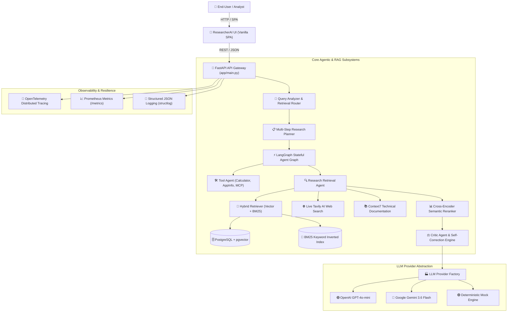
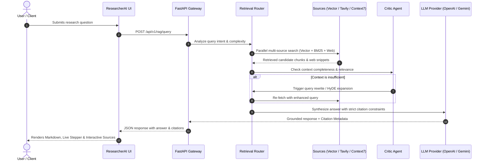
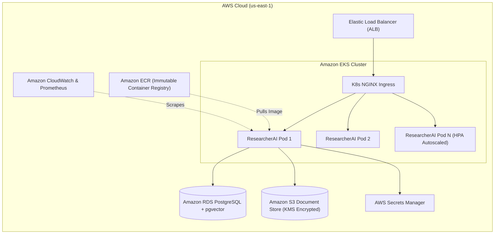

# ResearcherAI — Autonomous Deep Research & Knowledge Intelligence Platform

[](https://github.com/chan4kum/ResearcherAI/actions)
[](https://www.python.org/)
[](LICENSE)
[](#system-architecture)
[](#testing--quality-gates)

**ResearcherAI** is a cloud-native, enterprise-grade autonomous research platform. It combines **multi-agent reasoning (LangGraph)**, **adaptive multi-source retrieval (pgvector, BM25, Tavily, Context7)**, **critic self-correction loops**, and a **lightweight single-page user interface** to transform raw enterprise documents and live web data into auditable, citation-grounded research intelligence.

---

## 📑 Table of Contents

- [The Business Problem](#-the-business-problem)
- [How ResearcherAI Solves It](#-how-researcherai-solves-it)
- [System Architecture](#-system-architecture)
- [Multi-Agent Reasoning & Adaptive RAG Pipeline](#-multi-agent-reasoning--adaptive-rag-pipeline)
- [AWS Cloud-Native Production Architecture](#-aws-cloud-native-production-architecture)
- [Key Features](#-key-features)
- [Quick Start](#-quick-start)
- [API Reference](#-api-reference)
- [Production Deployment (Docker, Helm, Terraform)](#-production-deployment)
- [Testing & Quality Gates](#-testing--quality-gates)

---

## 🎯 The Business Problem

Modern enterprise organizations face critical bottlenecks in research, strategy formulation, and technical analysis:

1. **Information Fragmentation & Data Silos**:
   Knowledge is scattered across proprietary internal documents (PDFs, reports, manuals), databases, and the fast-moving external web. Teams waste up to **30% of their working hours** manually searching, cross-referencing, and synthesizing disjointed sources.
2. **LLM Hallucinations & Lack of Provenance**:
   Standard general-purpose LLMs generate convincing yet unsubstantiated claims. In high-stakes enterprise domains (finance, legal, semiconductor engineering, aerospace), answers without verifiable citation trails cannot be trusted.
3. **Stale Knowledge & Closed Horizons**:
   Traditional RAG systems only answer from a static vector database. If a user asks about breaking industry shifts, new regulatory standards, or live framework updates, static systems fail completely.
4. **Fragile, Monolithic Architectures**:
   Most AI prototypes lack resilience, observability, rate-limiting, and cloud-ready infrastructure, causing them to fail when scaled to production.

---

## 💡 How ResearcherAI Solves It

**ResearcherAI** eliminates these challenges through an auditable, agentic, and multi-source architecture:

```
                            RESEARCH QUERY
                                  │
                                  ▼
                   ┌─────────────────────────────┐
                   │   LangGraph Orchestrator    │
                   └──────────────┬──────────────┘
                                  │
            ┌─────────────────────┼─────────────────────┐
            ▼                     ▼                     ▼
  [ Internal Knowledge ]   [ Live Web Search ]   [ Developer Docs ]
     pgvector + BM25         Tavily AI Search        Context7 API
            │                     │                     │
            └─────────────────────┼─────────────────────┘
                                  │
                                  ▼
                   ┌─────────────────────────────┐
                   │    Cross-Encoder Reranker   │
                   └──────────────┬──────────────┘
                                  │
                                  ▼
                   ┌─────────────────────────────┐
                   │  Critic & Self-Correction   │
                   └──────────────┬──────────────┘
                                  │
                                  ▼
                    Grounded Answer + Citations [1..N]
```

- **Adaptive Multi-Source Routing**: Automatically determines whether a query requires internal proprietary PDFs, live internet search (Tavily), or official technical SDK documentation (Context7).
- **Hypothetical Document Embeddings (HyDE) & BM25 Hybrid Search**: Merges dense semantic vector similarity with sparse exact-match keyword indexing for peak retrieval precision.
- **Strict Grounding & Interactive Citations**: Every single fact in the generated answer is strictly tied to verifiable chunk IDs and URLs, rendered as interactive citation badges `[1]`, `[2]`.
- **Autonomous Multi-Step Decomposition**: Complex tasks are automatically decomposed into structured sequential sub-steps by an enterprise strategic reasoning planner.
- **Enterprise-Ready Infrastructure**: Built on FastAPI, OpenTelemetry tracing, Prometheus metrics, Terraform AWS IaC, and Kubernetes Helm charts.

---

## 🏛️ System Architecture

The platform follows a layered, decoupled service architecture:



---

## 🔄 Multi-Agent Reasoning & Adaptive RAG Pipeline

ResearcherAI implements a 6-stage cognitive processing loop:



---

## ☁️ AWS Cloud-Native Production Architecture

The platform is designed to deploy seamlessly on Amazon Web Services (AWS) using the included Terraform configurations and Helm charts:



---

## ✨ Key Features

| Domain | Capability | Description |
|:---|:---|:---|
| **Multi-Agent Orchestration** | **LangGraph Workflows** | Stateful graphs supporting branching, tool calling, memory preservation, and self-correction. |
| **Hybrid Retrieval** | **Vector + BM25 + Rerank** | Cosine similarity vector search coupled with BM25 sparse keyword ranking and cross-encoder reranking. |
| **Live Internet Intelligence** | **Tavily AI Search** | Real-time external search to ground research queries in breaking news and external data. |
| **Developer Documentation** | **Context7 Integration** | Structured code and SDK documentation extraction for software frameworks. |
| **Multi-Provider LLM** | **OpenAI / Gemini / Mock** | Dynamic runtime switching between OpenAI (`gpt-4o-mini`), Google Gemini (`gemini-3.6-flash`), and offline mock engines. |
| **Security & Safety** | **Prompt Injection Guards** | Input sanitation, regex guardrails, and role-based MCP security policies. |
| **Modern UI/UX** | **Lightweight Web App** | Single-page vanilla client with dark mode design tokens, citation badges, history drawer, and document upload modal. |
| **Infrastructure as Code** | **Terraform & Helm** | Automated AWS VPC, ECR, S3, KMS, Security Groups, and Kubernetes Helm packaging. |

---

## 🚀 Quick Start

### 1. Prerequisites
- Python 3.11+
- Git
- Docker & Docker Compose

### 2. Clone & Setup Environment
```bash
# Clone the repository
git clone https://github.com/chan4kum/ResearcherAI.git
cd ResearcherAI

# Create virtual environment
python3 -m venv .venv
source .venv/bin/activate

# Install dependencies in editable mode
pip install -e ".[dev]"

# Configure environment variables
cp .env.example .env
```

### 3. Configure API Keys in `.env`
Edit your `.env` file with your active API keys:
```ini
LLM_PROVIDER="openai"
LLM_MODEL="gpt-4o-mini"
OPENAI_API_KEY="sk-proj-..."

# Optional: Google Gemini
GEMINI_API_KEY="AQ.Ab..."

# Live Web Search & Technical Docs
TAVILY_API_KEY="tvly-dev-..."
contex7_api_key="ctx7sk-..."
```

### 4. Run the Local Development Server
```bash
uvicorn app.main:app --host 0.0.0.0 --port 8000 --reload
```

Open your browser to:
- 🌐 **Web Interface**: `http://localhost:8000/`
- 📖 **Interactive OpenAPI Docs**: `http://localhost:8000/docs`

---

## 📡 API Reference

### 1. Research & Knowledge Retrieval (`POST /api/v1/rag/query`)
Executes an adaptive hybrid search and synthesizes a citation-grounded response.
```bash
curl -X POST "http://localhost:8000/api/v1/rag/query" \
  -H "Content-Type: application/json" \
  -d '{
    "question": "What foundation models are supported in Amazon Bedrock?",
    "strategy": "normal",
    "top_k": 5,
    "rerank": true
  }'
```

### 2. Agent Task Orchestration (`POST /api/v1/tasks`)
Decomposes complex requests through LangGraph multi-step reasoning.
```bash
curl -X POST "http://localhost:8000/api/v1/tasks" \
  -H "Content-Type: application/json" \
  -d '{
    "task": "Analyze semiconductor fab investments in Silicon Saxony and calculate total expansion budget"
  }'
```

### 3. Document Ingestion (`POST /api/v1/documents/upload`)
Uploads and indexes documents with SHA-256 deduplication and pgvector embeddings.
```bash
curl -X POST "http://localhost:8000/api/v1/documents/upload" \
  -F "file=@/path/to/research_paper.pdf"
```

### 4. Health & Monitoring Endpoints
- `GET /live` — Kubernetes liveness probe
- `GET /ready` — Kubernetes readiness probe (checks DB & Vector store)
- `GET /metrics` — Prometheus metrics scraping endpoint

---

## 🚢 Production Deployment

### Option A: Local / Staging Docker Deployment
```bash
./scripts/deploy_local.sh
```

### Option B: Kubernetes Deployment with Helm
```bash
./scripts/deploy_k8s.sh researcher-ai true
```

### Option C: AWS Cloud Deployment (Terraform + EKS)
```bash
# 1. Provision AWS Infrastructure
cd terraform
terraform init
terraform apply -auto-approve

# 2. Build & Push Image to AWS ECR
aws ecr get-login-password --region us-east-1 | docker login --username AWS --password-stdin <AWS_ACCOUNT_ID>.dkr.ecr.us-east-1.amazonaws.com
docker build -t researcher-ai:v1 .
docker tag researcher-ai:v1 <AWS_ACCOUNT_ID>.dkr.ecr.us-east-1.amazonaws.com/enterprise-agentic-platform:v1
docker push <AWS_ACCOUNT_ID>.dkr.ecr.us-east-1.amazonaws.com/enterprise-agentic-platform:v1

# 3. Deploy Helm chart to AWS EKS
helm upgrade --install researcher-ai ./helm/agentic-platform -f ./helm/agentic-platform/values-eks.yaml
```

---

## 🧪 Testing & Quality Gates

ResearcherAI enforces strict quality gates with **398 automated test suites** covering unit, integration, failure engineering, security guardrails, and AI evaluation regression:

```bash
# Run complete test suite (100% offline runnable)
pytest -v

# Run AI evaluation regression suite against quality thresholds
python -m evals.run_evals

# Run linter and formatting checks
ruff check .
```

---

## 📄 License
This project is licensed under the MIT License — see the [LICENSE](LICENSE) file for details.
