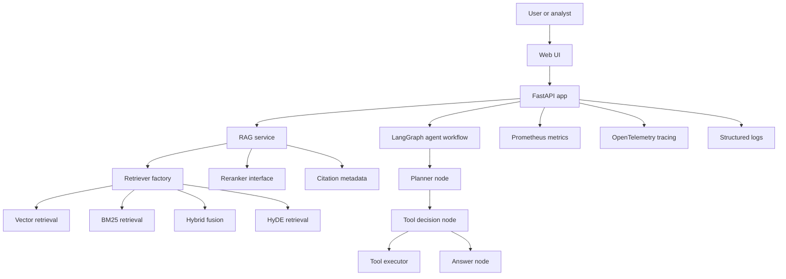

# ResearcherAI

ResearcherAI is a FastAPI-based research and knowledge assistant that combines document ingestion, hybrid retrieval, citation metadata, LangGraph task orchestration, prompt-safety guardrails, and Prometheus/OpenTelemetry instrumentation.

This repository is positioned as a production-oriented reference implementation. It contains API endpoints, database-backed vector search, offline-testable components, Docker/CI assets, and observability hooks. It does not claim externally benchmarked production performance.

## What It Demonstrates

- Agent workflow design with LangGraph, typed state, tool routing, and a planner/decision/execution/answer flow.
- Retrieval-augmented generation with dense vector retrieval, BM25 keyword retrieval, HyDE query expansion, reciprocal-rank fusion, reranking interfaces, and citation metadata.
- Document ingestion with chunk metadata, SHA-based deduplication, embedding generation, and pgvector-backed persistence.
- Safety controls including prompt-injection scanning, retrieved-context sanitization, secrets scrubbing, SSRF-oriented URL checks, and tool governance helpers.
- Service hardening patterns including structured logging, Prometheus metrics, OpenTelemetry tracing, rate limiting, cost guardrails, retry handling, and circuit-breaker utilities.
- A lightweight web interface and REST API suitable for local demos and architecture review.

## Evidence Map

| Capability | Evidence in code |
|---|---|
| FastAPI application and routing | `app/main.py`, `app/api/v1/router.py`, `app/api/v1/endpoints/` |
| RAG query endpoint and citation response models | `app/api/v1/endpoints/rag.py`, `app/models/schemas.py`, `app/services/rag/models.py` |
| Vector, BM25, hybrid, and HyDE retrieval | `app/services/rag/retriever.py`, `app/services/rag/bm25.py`, `app/services/rag/hyde.py`, `app/services/rag/fusion.py` |
| Adaptive evidence evaluation | `app/services/rag/adaptive.py` |
| Reranking interface and offline mock reranker | `app/services/rag/reranker.py` |
| LangGraph agent workflow | `app/services/agent/graph/workflow.py`, `app/services/agent/graph/nodes.py` |
| Tool registry and agent tools | `app/services/agent/tools/` |
| Prompt safety and document guardrails | `app/core/guardrails/` |
| Metrics, tracing, and structured logs | `app/core/metrics.py`, `app/core/tracing.py`, `app/core/logging.py`, `app/core/middleware.py` |
| Resilience and cost controls | `app/core/resilience/`, `app/core/retry.py` |
| Database schema and vector repository | `app/db/models.py`, `app/db/repository.py`, `app/db/migrations/` |
| CI and automated tests | `.github/workflows/ci.yml`, `tests/` |

See [`docs/CLAIM_AUDIT.md`](docs/CLAIM_AUDIT.md) for the detailed claim audit.

## Architecture



## Key Implementation Areas

### RAG Pipeline

The RAG service coordinates query validation, retrieval strategy selection, optional HyDE generation, optional reranking, prompt construction, retrieved-context sanitization, and response metadata. Citation objects carry source, document, chunk, similarity, and optional rerank metadata through the API response.

### Agent Workflow

The LangGraph workflow compiles a small but explicit agent graph:

1. planner
2. tool decision
3. optional tool execution
4. answer generation

This is useful as recruiter-facing evidence of stateful agent orchestration without overstating autonomous production behavior.

### Safety and Reliability

The codebase includes prompt-injection heuristics, delimiter filtering, retrieved-context sanitization, secrets scrubbing, URL safety helpers, cost accounting, rate limiting, circuit-breaker utilities, and structured error handling. These are implementation-level controls, not a claim that the system is secure against every adversarial input.

## Quick Start

### Prerequisites

- Python 3.11 or newer
- PostgreSQL with pgvector for full vector persistence flows
- Optional API keys for live LLM/search providers

### Install

```bash
git clone https://github.com/chan4kum/ResearcherAI.git
cd ResearcherAI
python3 -m venv .venv
source .venv/bin/activate
pip install -e ".[dev]"
cp .env.example .env
```

### Run Locally

```bash
uvicorn app.main:app --host 0.0.0.0 --port 8000 --reload
```

Open:

- Web UI: `http://localhost:8000/`
- OpenAPI docs: `http://localhost:8000/docs`
- Metrics: `http://localhost:8000/metrics`

## Common API Paths

| Endpoint | Purpose |
|---|---|
| `POST /api/v1/rag/query` | Ask a question against retrieved context and return answer/citations. |
| `POST /api/v1/documents/upload` | Upload and index documents. |
| `POST /api/v1/tasks` | Run the agent task workflow. |
| `GET /live` | Liveness probe. |
| `GET /ready` | Readiness probe. |
| `GET /metrics` | Prometheus metrics. |

## Evaluation and Quality

The repository includes pytest tests and CI configuration. No public benchmark numbers are claimed here. Evaluation work should be run and recorded before adding quality, latency, accuracy, or cost claims.

Recommended checks:

```bash
pytest
ruff check .
mypy app
```

See [`docs/EVALUATION_PLAN.md`](docs/EVALUATION_PLAN.md) for a concrete evaluation plan.

## Documentation

- [`docs/CLAIM_AUDIT.md`](docs/CLAIM_AUDIT.md) maps portfolio claims to repository evidence.
- [`docs/EVALUATION_PLAN.md`](docs/EVALUATION_PLAN.md) defines how to measure retrieval and answer quality without invented metrics.
- [`docs/adr/0001-retrieval-and-agent-architecture.md`](docs/adr/0001-retrieval-and-agent-architecture.md) records the retrieval and agent architecture decision.
