# Architecture & Design — Milestone 08: Vector Database (PostgreSQL + pgvector)

## Overview

Milestone 08 introduces the **Vector Database Subsystem** powered by **PostgreSQL with pgvector**, transforming the document ingestion and retrieval pipeline into a persistent 5-stage architecture:

$$\text{Document} \longrightarrow \text{Text Extraction} \longrightarrow \text{Chunking} \longrightarrow \text{Embedding} \longrightarrow \text{PostgreSQL / pgvector Storage \& Similarity Search}$$

---

## 5-Stage Ingestion & Retrieval Pipeline

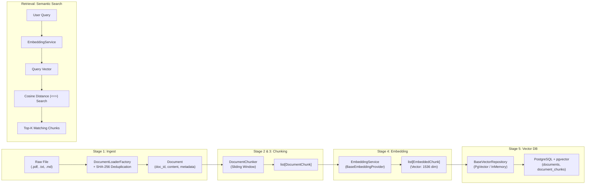

---

## Data Models & Schema Design

### 1. `documents` Table
Represents high-level ingested documents with content and extracted metadata.

| Column | Type | Description |
| :--- | :--- | :--- |
| `id` | `VARCHAR(64)` PRIMARY KEY | Deterministic / UUID Document identifier |
| `source` | `VARCHAR(512)` | File source path or original filename |
| `file_type` | `VARCHAR(32)` | File extension (`txt`, `pdf`, `md`) |
| `checksum` | `VARCHAR(64)` UNIQUE INDEX | SHA-256 hash for deduplication |
| `content` | `TEXT` | Raw extracted document text |
| `character_count` | `INTEGER` | Total character count |
| `word_count` | `INTEGER` | Total word count |
| `page_count` | `INTEGER` | Extracted page count |
| `custom_metadata` | `JSON` | Arbitrary JSON metadata attributes |
| `created_at` | `TIMESTAMP` | Timestamp of ingestion |

### 2. `document_chunks` Table
Represents individual text segments with dense vector embeddings.

| Column | Type | Description |
| :--- | :--- | :--- |
| `id` | `VARCHAR(128)` PRIMARY KEY | Unique chunk identifier (`doc_id_chunk_0`) |
| `doc_id` | `VARCHAR(64)` FK | Foreign key to `documents.id` (`ON DELETE CASCADE`) |
| `chunk_index` | `INTEGER` | 0-indexed ordinal position in document |
| `content` | `TEXT` | Chunk text content |
| `start_char` | `INTEGER` | Start character offset in parent document |
| `end_char` | `INTEGER` | End character offset in parent document |
| `character_count` | `INTEGER` | Chunk character length |
| `word_count` | `INTEGER` | Chunk word count |
| `custom_metadata` | `JSON` | Chunk-specific metadata |
| `embedding` | `VECTOR(1536)` | Dense float array with pgvector vector type |
| `created_at` | `TIMESTAMP` | Timestamp of chunk creation |

---

## Repository Abstraction (Ports & Adapters)

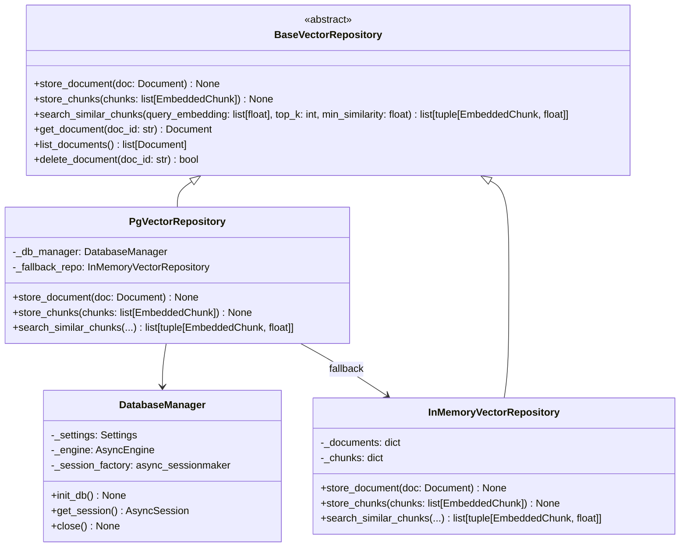

---

## Vector Similarity Search Mathematical Formulation

In PostgreSQL with `pgvector`, cosine distance is computed using the `<=>` operator:

$$\text{Cosine Distance}(\mathbf{u}, \mathbf{v}) = 1.0 - \text{Cosine Similarity}(\mathbf{u}, \mathbf{v}) = 1.0 - \frac{\mathbf{u} \cdot \mathbf{v}}{\|\mathbf{u}\|_2 \|\mathbf{v}\|_2}$$

SQLAlchemy pgvector query:
```python
distance_col = DocumentChunkRecord.embedding.cosine_distance(query_embedding).label("distance")
stmt = (
    select(DocumentChunkRecord, distance_col)
    .where(DocumentChunkRecord.embedding.is_not(None))
    .order_by(distance_col)
    .limit(top_k)
)
```

The similarity score is derived directly as:
$$\text{Similarity} = 1.0 - \text{distance}$$
Chunks with $\text{similarity} \ge \text{min\_similarity}$ are returned in strictly descending similarity order.

---

# Milestone 09: Basic RAG Subsystem

## Overview

Milestone 09 introduces **Retrieval-Augmented Generation (RAG)** by bridging vector similarity search directly into the LLM synthesis pipeline. Every generated answer is strictly grounded in retrieved document chunks and cites exact provenance metadata.

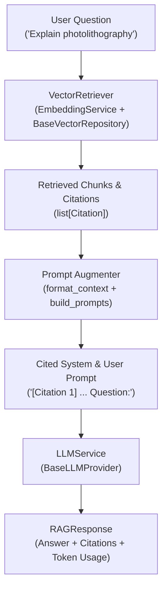

## Core RAG Components

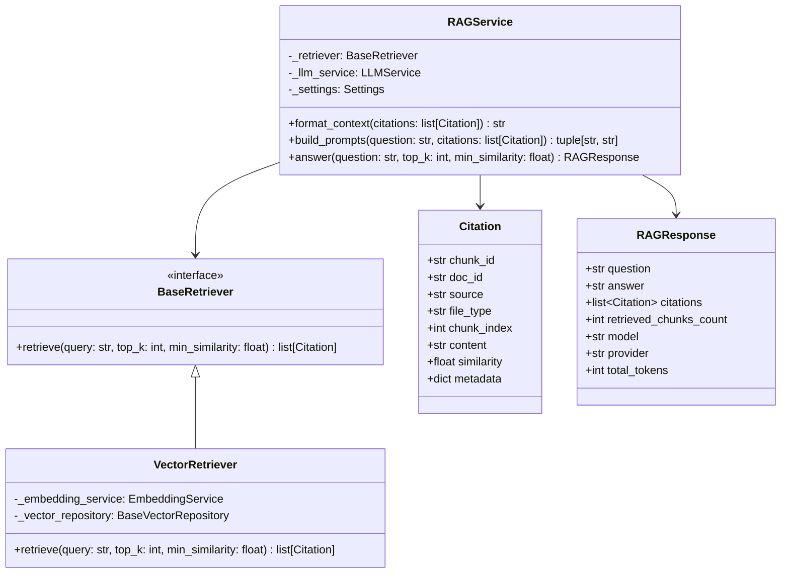

---

## 11. Milestone 10: Filtered Retrieval (Metadata-Aware RAG)

Milestone 10 introduces metadata-aware retrieval, allowing queries to be filtered along first-class document dimensions (`document_type`, `department`, `date`, `author`, `tags`, `custom_metadata`) before or during vector similarity scoring.

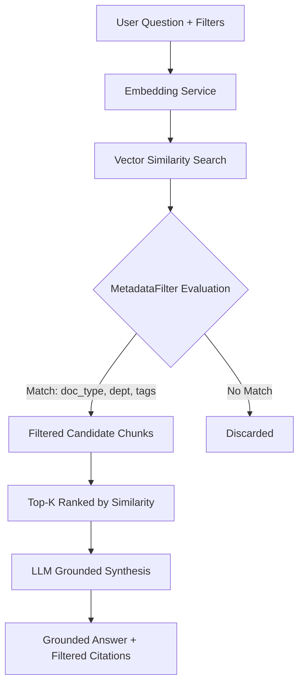

### Metadata Filter Structure
```json
{
  "question": "What does the Boeing quality report say?",
  "top_k": 3,
  "filters": {
    "document_type": "quality_report",
    "department": "QA",
    "tags": ["boeing", "aviation"]
  }
}
```

---

## 12. Milestone 11: Hybrid Retrieval (Lexical BM25 + Semantic Vectors + RRF)

Milestone 11 unifies dense semantic vector retrieval and sparse lexical BM25 retrieval into a pluggable hybrid retrieval engine, fusing results via Reciprocal Rank Fusion (RRF).

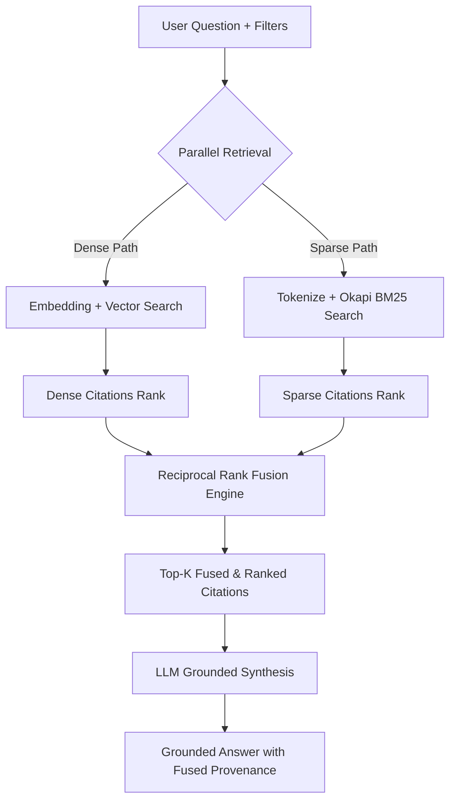

### Pluggable Retriever Architecture
- `BaseRetriever`: Abstract retriever interface.
- `VectorRetriever`: Dense semantic embedding search.
- `BM25Retriever`: Sparse Okapi BM25 keyword matching.
- `HybridRetriever`: Dual-path parallel execution with Reciprocal Rank Fusion ($k=60$) or convex Weighted Score Fusion ($\alpha$).
- `create_retriever(mode, ...)`: Dynamic runtime factory (`"hybrid"`, `"semantic"`, `"keyword"`).

---

## 13. Milestone 12: Reranking (Two-Stage Retrieval & Telemetry)

Milestone 12 introduces a modular **Two-Stage Retrieval Pipeline**:
1. **Stage 1 (Initial Retrieval)**: High-recall candidate search retrieving $N$ chunks from dense/sparse/hybrid retrievers.
2. **Stage 2 (Reranker)**: High-precision scoring applying cross-attention surrogate or cross-encoder evaluation to re-order candidates into final top-$K$ citations, generating full rank transition telemetry.

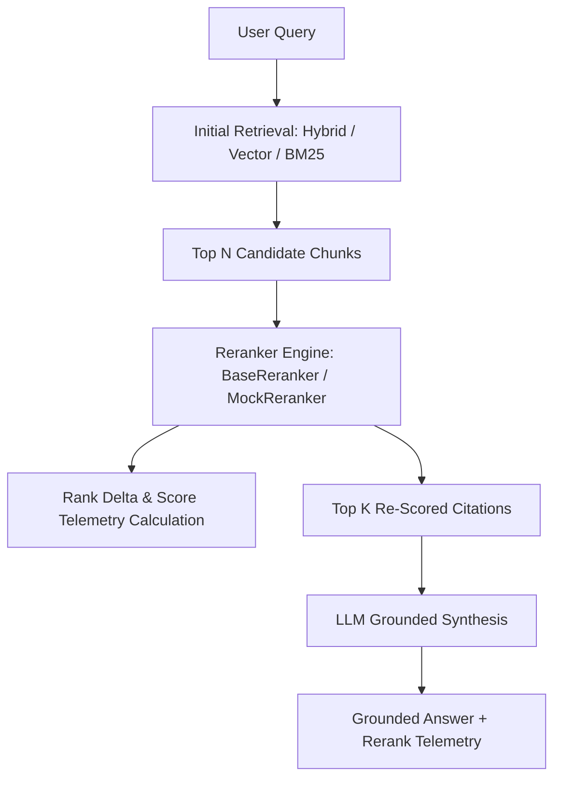

### Rank Transition Telemetry Structure
```json
{
  "chunk_id": "titanium_audit_chunk_0",
  "source": "titanium_compressor_failure_audit.txt",
  "initial_rank": 3,
  "reranked_rank": 1,
  "initial_score": 0.65,
  "rerank_score": 0.9412,
  "rank_delta": 2
}
```

---

## 14. Milestone 13: Query Understanding & Semantic Decomposition

Milestone 13 introduces a pre-retrieval **Query Analyzer** stage. Before executing retrieval, the raw query is classified and decomposed into structured semantics without triggering retrieval.

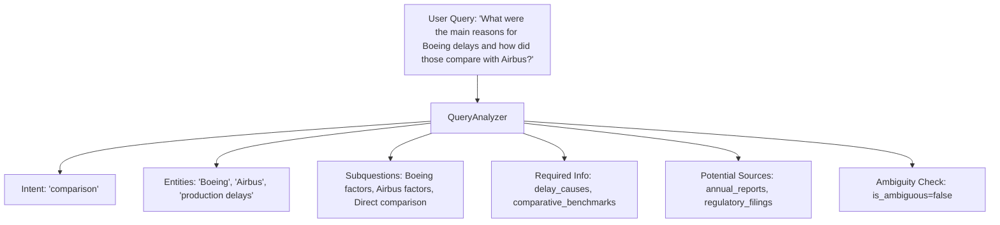

### Query Analysis Schema
```json
{
  "original_query": "What were the main reasons for Boeing's production delays and how did those compare with Airbus?",
  "intent": "comparison",
  "entities": [
    {"text": "Boeing", "label": "organization", "category": "aerospace"},
    {"text": "Airbus", "label": "organization", "category": "aerospace"},
    {"text": "production delays", "label": "metric_issue", "category": "manufacturing"}
  ],
  "subquestions": [
    "What were the factors affecting Boeing?",
    "What were the factors affecting Airbus?",
    "How do Boeing and Airbus compare directly?"
  ],
  "required_information_types": ["delay_causes", "production_schedules", "comparative_benchmarks"],
  "potential_source_types": ["annual_reports", "regulatory_filings", "industry_audits"],
  "is_ambiguous": false,
  "clarification_needed": null,
  "temporal_scope": null,
  "confidence_score": 0.95
}
```

---

## 15. Milestone 14: Iterative Query Rewriting & Retrieval Evaluation

Milestone 14 introduces a multi-attempt **Retrieve $\to$ Evaluate $\to$ Rewrite Loop** with infinite loop prevention and full iteration history tracking.

```mermaid
flowchart TD
    Q[Original Query] --> QA[Query Analyzer]
    QA --> LoopStart{Attempt <= Max Retries?}
    LoopStart -->|Yes| Ret[Retrieve Candidates]
    Ret --> Eval{Retrieval Evaluator}
    Eval -->|Sufficient| Rerank[Optional Rerank Stage]
    Eval -->|Deficient| CheckRetry{Attempts Remaining?}
    CheckRetry -->|Yes| Rewriter[Query Rewriter]
    Rewriter --> LoopStart
    CheckRetry -->|No (Max Attempts)| Rerank
    Rerank --> LLM[LLM Grounded Synthesis]
    LLM --> Response[Response + Rewrite History Telemetry]
```

### Retrieval Deficiency Evaluators
1. **Low Relevance**: Top similarity or fusion score below minimum relevance threshold.
2. **Insufficient Evidence**: Fewer candidate chunks retrieved than required evidence threshold.
3. **Missing Entities**: Essential named entities from `QueryAnalysis` absent from retrieved text.
4. **Poor Coverage**: Comparative or multi-part query missing coverage for one or more subjects.
5. **Ambiguity**: Query flagged as underspecified.

---

## 16. Milestone 15: Hypothetical Document Embeddings (HyDE)

Milestone 15 adds HyDE as a zero-shot semantic retrieval bridge:

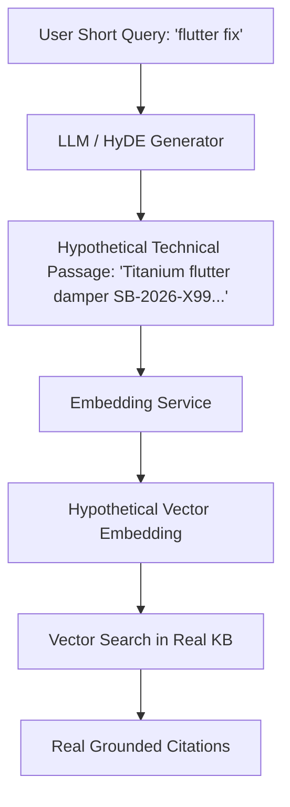

### Why HyDE Bridges the Semantic Asymmetry Gap
- **Question-Document Gap**: Queries and documents occupy distinct semantic distributions in dense vector embedding space. A brief question ("flutter fix") lacks technical co-occurrences.
- **Hypothetical Projection**: HyDE translates the query from *question space* into a synthetic, domain-dense *document space* passage before computing vector embeddings.
- **Closer Latent Proximity**: The synthetic passage vector is dramatically closer in cosine similarity to actual knowledge base chunks, boosting recall on domain-specific terminology.

---

## 17. Milestone 16: Retrieval Source Abstraction

Milestone 16 provides a unified `BaseRetrievalSource` interface across heterogeneous repositories:

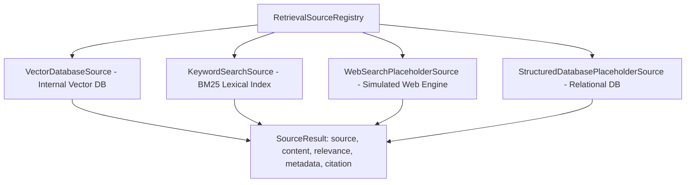

### Standardized `SourceResult` Schema
```json
{
  "source": "relational_maintenance_db",
  "source_type": "structured_db",
  "content": "Table: aircraft_maintenance_log | Record: LOG-2026-777X-001\n  aircraft_model: Boeing 777-9\n  component: Wing Flutter Damper...",
  "relevance": 0.8500,
  "metadata": {
    "table": "aircraft_maintenance_log",
    "primary_key": "LOG-2026-777X-001"
  },
  "citation": {
    "chunk_id": "db_aircraft_maintenance_log_LOG-2026-777X-001",
    "doc_id": "table_aircraft_maintenance_log",
    "source": "sql://aircraft_maintenance_log/LOG-2026-777X-001",
    "file_type": "json",
    "similarity": 0.8500
  }
}
```

---

## 18. Milestone 17: Intelligent Multi-Source Routing

Milestone 17 adds semantic intent-aware multi-source routing:

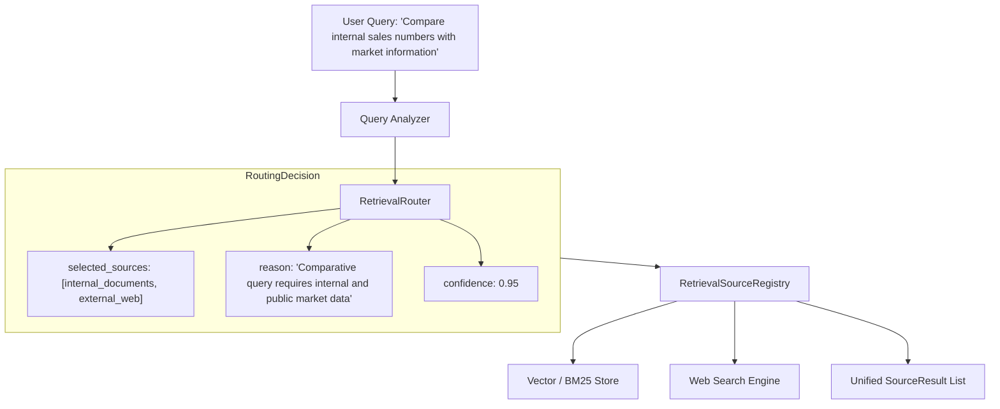

### Telemetry Logging
Every routing decision records:
- `query`
- `intent`
- `selected_sources`
- `reason`

---

## 19. Milestone 18: Adaptive Retrieval Pipeline

Milestone 18 implements the closed-loop adaptive retrieval and evidence evaluation architecture:

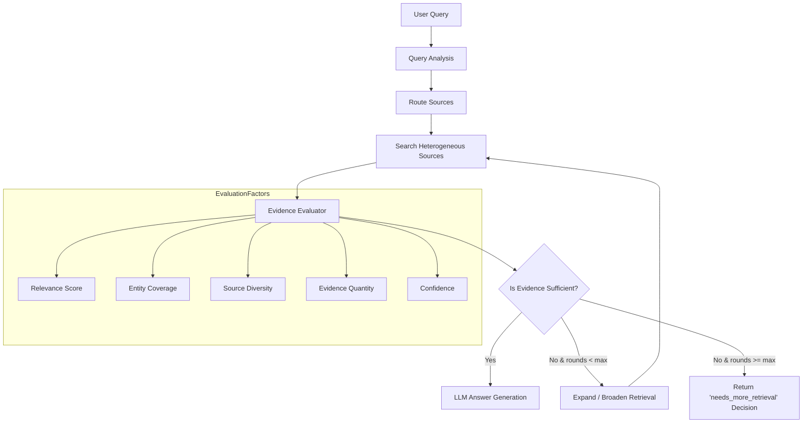

### Multi-Dimensional Evidence Metrics
1. **Relevance**: Blended mean and max similarity ($0.4 \times \text{mean} + 0.6 \times \text{max}$).
2. **Coverage**: Fraction of identified query entities present in retrieved passages.
3. **Source Diversity**: Proportion of target source types populated with at least one evidence item.
4. **Evidence Quantity**: Total count of distinct evidence snippets.
5. **Composite Confidence**: Weighted combination of relevance ($45\%$), coverage ($35\%$), and diversity ($20\%$).

---

## 20. Milestone 19: Agent-Driven Retrieval Loop

Milestone 19 introduces an autonomous agentic retrieval loop with strict guardrails:

```mermaid
flowchart TD
    Q[User Query] --> QA[Query Analyzer]
    QA --> Plan[Retrieval Planner]
    Plan --> Needs{Needs Retrieval?}
    Needs -->|No (Greeting/Direct)| Direct[Direct LLM Synthesis]
    Needs -->|Yes| Sel[Source Selection & Route]

    subgraph LoopGuardrails[Hard Limit Guardrails: max_iter, max_tools, max_docs, timeout]
        Sel --> Ret[Retrieve from Sources]
        Ret --> Eval[Evidence Evaluator]
        Eval --> Suff{Evidence Sufficient?}
        Suff -->|No & bounds OK| Rew[Rewrite Query]
        Rew --> Ret
        Suff -->|Yes or bounds reached| Syn[Synthesize Answer with Citations]
    end

    Direct --> Persist[Persist Telemetry Trace]
    Syn --> Persist
```

### Guaranteed Safety Limits
- **Max Iterations**: Bounded retry loop (default: 3).
- **Max Tool Calls**: Cap on cumulative source invocations (default: 6).
- **Max Retrieved Documents**: Buffer cap preventing context bloat (default: 20).
- **Hard Timeout**: System timer guard terminating runaway queries (default: 10.0s).
- **Telemetry Trace**: Persisted to `RetrievalTraceStore` for complete auditability.

---

## 21. Milestone 20: Multi-Step Research Planner

Milestone 20 implements structured multi-step inquiry decomposition, breaking complex comparative or multifaceted questions into an ordered sequence of focused subquestions with dependency pointers.

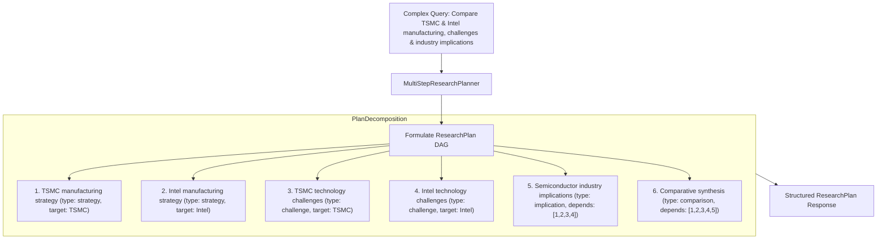

### Research Plan Schema
- `ResearchSubquestionType`: `BACKGROUND`, `FACTUAL`, `STRATEGY`, `CHALLENGE`, `COMPARISON`, `IMPLICATION`, `SYNTHESIS`.
- `ResearchSubquestion`: Atomic query unit with `id`, `index`, `question`, `subquestion_type`, `target_entities`, `expected_output_type`, `suggested_sources`, and `depends_on`.
- `ResearchPlan`: Top-level plan model containing `plan_id`, `original_query`, `overall_goal`, `subquestions`, `estimated_complexity`, and `suggested_synthesis_strategy`.

---

## 22. Milestone 21: Multi-Step Research Execution & Synthesis

Milestone 21 implements sequential multi-step research execution, coordinating retrieval across all planned subquestions, caching evidence into a structured `ResearchEvidenceStore`, and synthesizing an authoritative holistic final report.

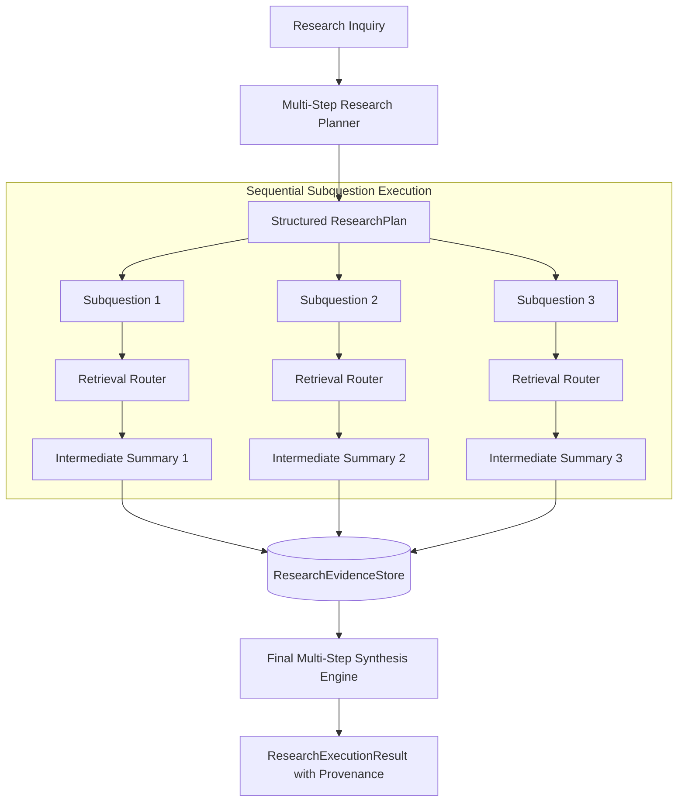

### Research Execution Retained Subquestion State
Each executed subquestion retains:
- **`query`**: Focused subquestion text executed.
- **`sources`**: List of retrieval sources queried (`internal_vector_db`, `external_web`, etc.).
- **`evidence`**: Raw text snippets retrieved.
- **`citations`**: Structured `Citation` objects with provenance and similarity scores.
- **`status`**: `PENDING`, `EXECUTING`, `COMPLETED`, `FAILED`, or `SKIPPED`.
- **`sub_answer`**: Intermediate grounded answer generated for that specific subquestion.

---

## 23. Milestone 22: Parallel Research Execution & Failure Isolation

Milestone 22 brings native `asyncio` parallel execution to independent research subquestions with topological wave scheduling, strict concurrency bounds, timeouts, retries, and failure isolation.

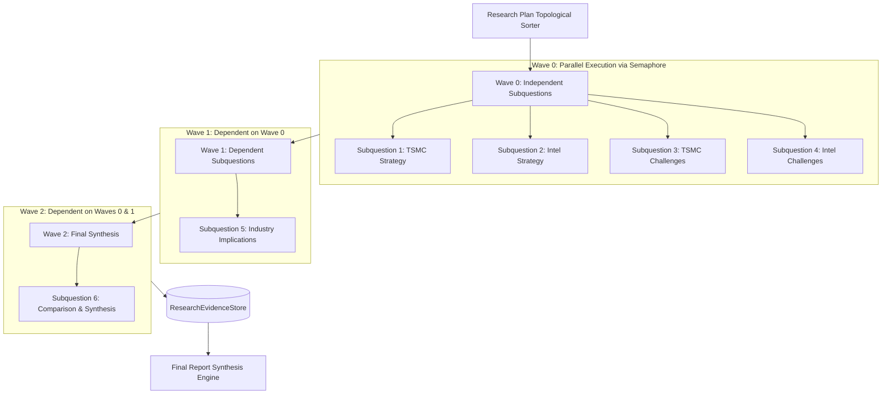

### Safety & Reliability Guardrails
1. **Topological Wave Partitioning**: Identifies independent DAG nodes and executes them concurrently while strictly preserving prerequisite dependencies.
2. **Concurrency Limiter**: Bounded via `asyncio.Semaphore(max_concurrency)` (default: 4).
3. **Per-Step Timeout**: Isolated with `asyncio.wait_for(...)` (default: 5.0s).
4. **Transient Retries**: Automatic exponential backoff for transient failures (default: 2 retries).
5. **Failure Isolation**: A subquestion failure records `status=FAILED` without interrupting parallel sibling tasks or aborting final report generation (producing an overall `status="partial"` report).

---

## 24. Milestone 23: Self-Correction & Critic Agent

Milestone 23 introduces an adversarial **Critic Agent** and **Self-Correction Engine** that evaluates draft answers across 6 core defect dimensions and orchestrates a bounded improvement loop.

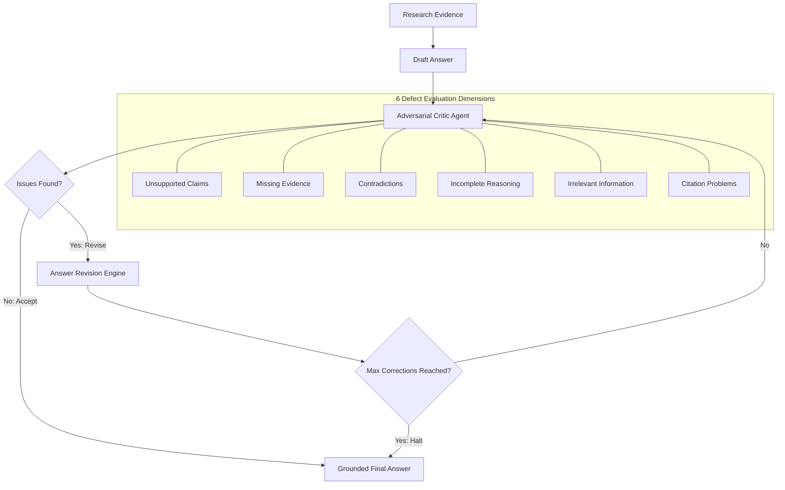

### Defect Taxonomy
1. **`UNSUPPORTED_CLAIM`**: Statements asserting facts, futuristic dates, or entities absent from evidence.
2. **`MISSING_EVIDENCE`**: Omission of requested comparisons, entities, or core questions.
3. **`CONTRADICTION`**: Direct internal conflicts or contradictions against source ground truth.
4. **`INCOMPLETE_REASONING`**: Unsupported logical leaps or non-sequiturs.
5. **`IRRELEVANT_INFORMATION`**: Off-topic fluff or unrelated tangents.
6. **`CITATION_PROBLEM`**: Missing citations or references to non-existent chunk IDs.

---

## 25. Milestone 24: Claim-by-Claim Answer Verification

Milestone 24 introduces the **Answer Verification Stage** that extracts atomic factual claims from answers, verifies each claim against retrieved evidence, classifies support status, calculates verification confidence, and synthesizes a sanitized answer.

```mermaid
flowchart TD
    Ans[Draft / Synthesized Answer] --> Extract[Atomic Claim Extractor]
    Extract --> C1[Claim 1]
    Extract --> C2[Claim 2]
    Extract --> C3[Claim 3]
    Extract --> C4[Claim 4]

    Ev[(Retrieved Evidence / Citations)] --> Verifier[Answer Verifier Engine]

    C1 --> Verifier --> O1[SUPPORTED (conf: 0.95)]
    C2 --> Verifier --> O2[PARTIALLY_SUPPORTED (conf: 0.70)]
    C3 --> Verifier --> O3[UNSUPPORTED (conf: 0.10)]
    C4 --> Verifier --> O4[CONTRADICTED (conf: 0.95)]

    O1 & O2 & O3 & O4 --> Rep[VerificationReport]
    Rep --> Final[Sanitized Verified Final Answer]
```

### Claim Support Status Taxonomy
- **`SUPPORTED`**: The assertion is directly substantiated by evidence passages and verified against citations.
- **`PARTIALLY_SUPPORTED`**: The core claim aligns with evidence but includes unverified estimates or qualifications.
- **`UNSUPPORTED`**: The evidence contains no factual basis for the claim (e.g. fabricated facts, unverified rumors).
- **`CONTRADICTED`**: The claim directly conflicts with verified metrics or operational facts in evidence.

### Sanitized Answer Generation
The verifier automatically produces a `verified_answer` that hedges partially supported claims and explicitly marks unverified/refuted claims (e.g. `[Unverified Claim: ...]`, `[Refuted Assertion: ...]`), guaranteeing that ungrounded statements are never presented to users as confirmed facts.

---

## 26. Milestone 25: Complete Agentic Research Loop

Milestone 25 unifies the entire modular intelligence stack into the **Agentic Research Orchestrator**, providing end-to-end execution without unnecessary reimplementation.

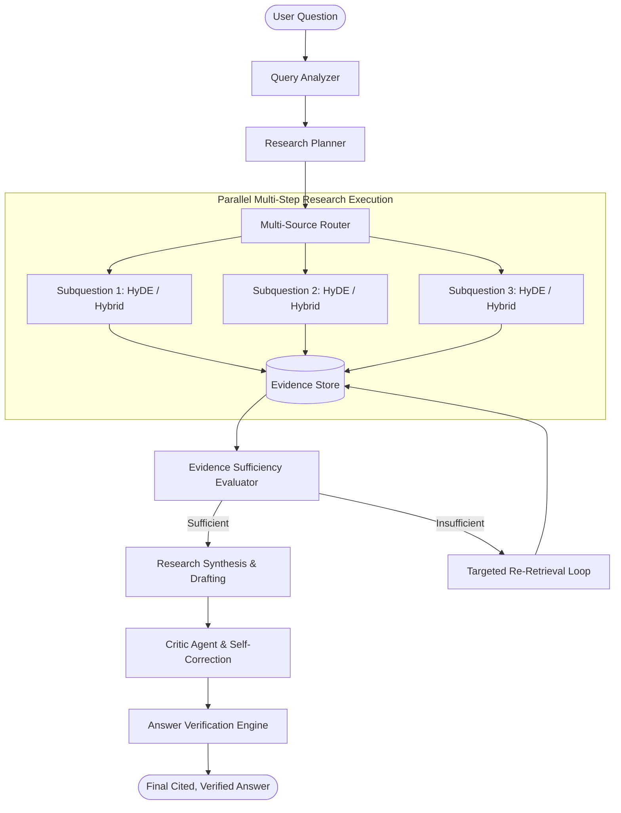

### Integrated Capabilities
1. **Query Analysis & Planning**: Identifies query complexity, extracts entities, and constructs dependency DAGs.
2. **Parallel Topological Wave Execution**: Dispatches independent research steps concurrently with concurrency limits, timeouts, and retries.
3. **Hybrid Multi-Source Retrieval**: Combines semantic embeddings, BM25 lexical search, reciprocal rank fusion, and cross-encoder reranking.
4. **Adversarial Self-Correction**: Checks 6 defect dimensions (unsupported claims, missing evidence, contradictions, incomplete reasoning, irrelevant info, citation bugs) in bounded iterations.
5. **Claim-by-Claim Verification**: Validates each atomic assertion, generates confidence scores, and produces a sanitized, cited final answer.

---

## 27. Milestone 27: Model Context Protocol (MCP) Client

Milestone 27 introduces native **Model Context Protocol (MCP)** client capability, enabling the agent to dynamically discover and invoke tools hosted on local or remote MCP servers via the standard JSON-RPC 2.0 protocol.

```mermaid
flowchart LR
    subgraph AgentSystem["Agent Subsystem"]
        Agent[BasicAgent / LangGraph] --> Reg[ToolRegistry]
        Reg --> Internal[Native Internal Tools (e.g. app_info)]
        Reg --> Adapter[MCPToolAdapter (BaseTool)]
    end
    
    subgraph MCPClientSubsystem["MCP Client Layer"]
        Adapter --> Client[MCPClient]
    end
    
    subgraph MCPServerSubsystem["MCP Server Layer"]
        Client -->|JSON-RPC 2.0: tools/call| Server[LocalMCPServer]
        Server --> Calc[Migrated Calculator Tool]
        Calc -->|Result| Server
    end
    
    Server -->|MCPResponse| Client
    Client -->|ToolResult| Adapter
    Adapter --> Agent
```

### Key Architectural Highlights
1. **Protocol Compliance**: Implements JSON-RPC 2.0 endpoints for `initialize`, `ping`, `tools/list`, and `tools/call`.
2. **Seamless Coexistence**: Internal native tools and MCP-hosted tools share the unified `ToolRegistry` interface.
3. **Migrated Capability**: The `calculator` tool runs on the MCP server and is accessed dynamically by the agent via `MCPClient` and `MCPToolAdapter`.

---

## 28. Milestone 28: Dynamic MCP Capability Discovery & Safety Governance

Milestone 28 introduces **Dynamic MCP Capability Discovery** paired with **Safety Governance**, allowing the Agent to dynamically discover and mount MCP tools from multiple servers at runtime with strict whitelisting, invocation caps, execution timeouts, and failure isolation.

```mermaid
flowchart TD
    subgraph MultiServerLayer["MCP Servers"]
        S1[Math MCP Server]
        S2[Info MCP Server]
        S3[Untrusted MCP Server]
    end

    subgraph DiscoveryLayer["MCP Discovery Manager"]
        Disc[MCPDiscoveryManager] --> Query[Query tools/list Handshake]
    end
    
    S1 --> Disc
    S2 --> Disc
    S3 -.->|Blocked by Policy| Disc

    subgraph GovernanceLayer["Safety Governance (MCPSafetyPolicy)"]
        Policy[Allowed Servers Whitelist]
        Policy --> ToolWhitelist[Allowed Tools Whitelist]
        ToolWhitelist --> Tracker[MCPInvocationTracker]
        Tracker --> Timeout[Per-Tool Timeout Guardrail]
    end
    
    Disc --> GovernanceLayer
    GovernanceLayer --> Adapter[MCPToolAdapter]
    Adapter --> Registry[Agent ToolRegistry]
    Registry --> Agent[BasicAgent / LangGraph State Engine]
```

### Safety Controls
1. **Server Whitelist**: Rejects tool discovery from unauthorized server identifiers.
2. **Tool Whitelist**: Filters out non-whitelisted tools even if exposed by authorized servers.
3. **Execution Timeout**: Enforces hard execution timeouts to prevent hanging tool dispatches.
4. **Invocation Limits**: Thread-safe invocation tracker enforcing maximum tool execution caps per session/task.

---

## 29. Milestone 29: Production API Foundation

Milestone 29 establishes the enterprise-grade **Production API Foundation**, incorporating structured logging, correlation IDs, centralized exception handling, timeout enforcement, async retries, graceful shutdown, and Kubernetes-ready readiness/liveness probes while preserving backward compatibility.

```mermaid
flowchart TD
    subgraph ClientLayer["Incoming HTTP Client Request"]
        Req[HTTP Request + x-request-id]
    end

    subgraph MiddlewareLayer["Middleware Pipeline"]
        CORS[CORS Middleware] --> TimeoutM[Timeout Middleware (30s / custom)]
        TimeoutM --> ReqID[RequestIdMiddleware (uuid + process timing)]
    end

    subgraph RouterLayer["FastAPI Application & Subsystems"]
        Probes["Health & Probes (/health, /ready, /live)"]
        APIs["Versioned Endpoints (/api/v1/...)"]
        Retries["Async Retry Engine (Exponential Backoff + Jitter)"]
    end

    subgraph DiagnosticsLayer["Resilience & Diagnostics"]
        Errors["Centralized Exception Handlers (400, 404, 422, 500, 503, 504)"]
        Logging["Structured JSON Logging (structlog + timestamps)"]
        Lifespan["Graceful Shutdown (DB Session Pools / MCP Flush)"]
    end

    Req --> MiddlewareLayer
    MiddlewareLayer --> RouterLayer
    RouterLayer -.-> DiagnosticsLayer
```

### Key Production Features
1. **Request IDs & Correlation**: All requests receive `x-request-id` and `x-process-time-ms` headers with JSON logs correlated by request ID.
2. **Standardized Error Responses**: All errors (400, 404, 422, 500, 503, 504) return uniform `ErrorResponse(error=ErrorDetail(...))` payloads.
3. **Timeout & Failure Isolation**: `TimeoutMiddleware` enforces request timeouts, returning structured 504 `REQUEST_TIMEOUT` on slow operations.
4. **Resilient Retries**: `async_retry` with exponential backoff and randomized jitter for transient network or service failures.
5. **Kubernetes Health Probes**:
   - `/health`: Backward-compatible basic health status (`ok`, `version`, `environment`).
   - `/ready` and `/health/ready`: Deep dependency readiness check (LLM, vector repository, database).
   - `/live` and `/health/live`: Heartbeat and uptime tracking (`uptime_seconds`).
6. **Graceful Shutdown**: Fast and clean teardown of database connection pools and background tasks during SIGTERM/SIGINT.

---

## 30. Milestone 30: API Security & Role-Based Access Control (RBAC)

Milestone 30 introduces development-friendly, production-ready **Authentication and Role-Based Access Control (RBAC)** without insecure password storage, relying on configuration-backed secrets, declarative FastAPI dependencies, and strict 401/403 RFC-compliant error responses.

```mermaid
flowchart TD
    subgraph ClientReq["Client Request"]
        H["Authorization: Bearer <key> or X-API-Key: <key>"]
    end

    subgraph AuthLayer["Authentication (get_current_user)"]
        Extract[Header Token Extraction] --> TokenCheck{Valid Token in Config?}
        TokenCheck -- No / Missing --> E401["HTTP 401 UNAUTHORIZED"]
        TokenCheck -- Yes --> UserObj["UserIdentity (id, username, roles)"]
    end

    subgraph RBACLayer["Authorization (require_roles)"]
        UserObj --> RoleCheck{Has Required Role or Admin?}
        RoleCheck -- No --> E403["HTTP 403 FORBIDDEN"]
        RoleCheck -- Yes --> Handler["Execute Protected Endpoint"]
    end

    H --> AuthLayer
```

### Roles and Guardrails
- **Roles**: `admin`, `researcher`, `user`, `viewer`.
- **Superuser Elevation**: Users with `admin` automatically pass role checks across all endpoints.
- **Dependencies**: `get_current_user`, `require_roles(Role.ADMIN, ...)`, `require_admin`, `require_researcher`.
- **Standardized Errors**: Emits structured `ErrorResponse(error=ErrorDetail(code="UNAUTHORIZED" | "FORBIDDEN", ...))` payloads.

---

## 31. Milestone 31: Resilience & Cost Guardrails

Milestone 31 protects the system from expensive, runaway Agentic AI executions by introducing multi-tier **Rate Limiting**, **Cost Budget Guardrails**, **Circuit Breakers**, and **Request Cancellation**.

```mermaid
flowchart TD
    subgraph RateLimitingLayer["Rate Limiter (RateLimitMiddleware)"]
        Req[Incoming Request] --> SlidingWindow[Sliding Window Frequency Check]
        SlidingWindow -- Burst / Window Limit Exceeded --> E429[HTTP 429 RATE_LIMIT_EXCEEDED]
    end

    subgraph BudgetingLayer["Cost & Execution Budget Guardrail (CostBudgetTracker)"]
        SlidingWindow --> BudgetCheck{Tool Calls < Cap & Iterations < Cap?}
        BudgetCheck -- Budget Exceeded --> E429B[HTTP 429 BUDGET_EXCEEDED]
    end

    subgraph CircuitBreakerLayer["Circuit Breaker (CircuitBreaker)"]
        BudgetCheck --> CircuitCheck{Circuit State CLOSED / HALF_OPEN?}
        CircuitCheck -- Circuit OPEN --> E503[HTTP 503 CIRCUIT_BREAKER_OPEN]
        CircuitCheck -- OK --> Dispatch[Execute LLM / Research Step]
    end

    subgraph CancellationLayer["Asynchronous Cancellation"]
        Dispatch --> Run[Async Agent Coroutine]
        ClientDisconnect[Client Disconnect] -.->|Propagates CancelledError| Run
    end
```

### Key Guardrails
1. **Sliding Window Rate Limiter**: Configurable requests-per-minute and 1-second burst protection with `Retry-After` headers.
2. **Cost Budget Guardrail (`CostBudgetTracker`)**: Hard limit capping maximum tool executions (`max_tool_calls_cap`) and maximum research iterations (`max_research_iterations_cap`) to prevent infinite spending loops.
3. **Circuit Breaker Subsystem**: Automatically trips to `OPEN` on consecutive downstream failures to fast-fail subsequent requests and transitions back to `CLOSED` upon verified recovery in `HALF_OPEN` state.
4. **Asynchronous Request Cancellation**: Gracefully propagates task cancellations without leaving orphaned background computations.

---

## 32. Milestone 32: Containerisation & Deployment Lifecycle

Milestone 32 introduces a security-hardened, multi-stage production Docker containerization for the application.

```mermaid
flowchart TD
    subgraph SourceCode["1. Source Code & Assets"]
        App["app/ (Routers, Agents, RAG, Core)"]
        KB["KB/ (Knowledge Base Documents)"]
        Config["pyproject.toml, README.md, .dockerignore"]
    end

    subgraph BuildStage["2. Multi-Stage Docker Build (python:3.12-slim)"]
        Builder["Builder Stage: Build-essential & Compilers"]
        Venv["/opt/venv (Isolated Python Dependencies)"]
        Builder -->|pip install --no-cache-dir .| Venv
    end

    subgraph ContainerImage["3. Production Image (293MB)"]
        Runner["Runner Stage: Minimal Runtime OS"]
        VenvCopy["COPY --from=builder /opt/venv"]
        NonRootUser["appuser (UID 10001 / GID 10001)"]
        Healthcheck["HEALTHCHECK (urllib -> /health)"]
    end

    subgraph RunningContainer["4. Running Container & Process"]
        Container["Docker Container (Namespaces & Cgroups)"]
        Process["Uvicorn ASGI Server (PID 1, non-root)"]
        Port["Port 8000 (Exposed via host binding)"]
    end

    SourceCode --> BuildStage
    BuildStage --> ContainerImage
    ContainerImage --> RunningContainer
```

### Lifecycle Transition: Source Code → Image → Container → Running Process
1. **Source Code**: Human-readable Python scripts, package manifests, and knowledge bases stored in the filesystem.
2. **Image**: An immutable, layered tarball snapshot containing the minimal Debian Linux rootfs, Python 3.12 runtime, pre-compiled virtual environment dependencies (`/opt/venv`), and application bytecode.
3. **Container**: An instantiated, isolated execution unit created by the container engine using Linux namespaces (PID, NET, MNT, IPC, UTS) and cgroups for resource partitioning.
4. **Running Process**: An active OS process (Uvicorn ASGI server) running inside the container under the unprivileged `appuser` (UID 10001) listening on `0.0.0.0:8000`.

---

## 33. Milestone 33: Local Platform with Docker Compose

Milestone 33 orchestrates the complete platform locally using **Docker Compose**, interconnecting the FastAPI API server with PostgreSQL (`pgvector/pgvector:pg16`), persistent volumes, isolated bridge networking, and health check dependency gating.

```mermaid
flowchart TD
    subgraph Network["Docker Bridge Network (agentic-network)"]
        subgraph PostgresService["postgres (pgvector/pgvector:pg16)"]
            PGServer["PostgreSQL Server (Port 5432)"]
            PGHealth["Healthcheck: pg_isready -U postgres -d agentic_db"]
            PGVol[("postgres_data Volume")]
            PGServer --- PGVol
            PGServer --- PGHealth
        end

        subgraph APIService["api (enterprise-agentic-platform:latest)"]
            FastAPI["FastAPI / Uvicorn ASGI Server"]
            APIHealth["Healthcheck: urllib -> /health"]
            APIVol[("app_data Volume")]
            FastAPI --- APIVol
            FastAPI --- APIHealth
        end

        FastAPI -->|depends_on: postgres (service_healthy)| PGServer
        FastAPI -->|asyncpg + pgvector TCP 5432| PGServer
    end

    HostMachine["Host Client / Developer"] -->|Port 8000| FastAPI
    HostMachine -->|Port 5433 (Optional DB Tooling)| PGServer
```

### Verified End-to-End Platform Flow
1. **Health Probes**: `GET /health`, `GET /ready`, `GET /live` all report healthy.
2. **PostgreSQL Vector Sync**: `POST /api/v1/documents/sync-kb` chunks, embeds, and loads knowledge documents directly into Postgres.
3. **Vector Similarity Search**: `POST /api/v1/documents/search` performs cosine similarity search via pgvector extension.
4. **RAG Pipeline**: `POST /api/v1/rag/query` executes full retrieval + answer synthesis with source grounding.
5. **Agent Task Execution**: `POST /api/v1/tasks/` generates plans and dynamically invokes tools (`calculator`, `app_info`, `mcp`).

---

## 34. Milestone 34: Continuous Integration (CI)

Milestone 34 establishes automated, multi-stage **Continuous Integration (CI)** powered by GitHub Actions.

```mermaid
flowchart TD
    Trigger["Git Push / Pull Request / workflow_dispatch"] --> Stage1

    subgraph Stage1["Stage 1: Lint & Static Typing"]
        Ruff["Ruff Linter & Formatter"]
        Mypy["Mypy Strict Static Type Checker"]
    end

    Stage1 --> Stage2

    subgraph Stage2["Stage 2: Offline Test Suite"]
        Pytest["Pytest (255/255 Unit & Integration Tests)"]
        Coverage["JUnit XML Test Reporting"]
    end

    Stage2 --> Stage3

    subgraph Stage3["Stage 3: Security & Secret Auditing"]
        Bandit["Bandit Static AST Vulnerability Scanner"]
        LeakCheck["Git Secret Leak Prevention (.env untracked)"]
    end

    Stage3 --> Stage4

    subgraph Stage4["Stage 4: Container Build Verification"]
        DockerBuild["Docker Buildx Multi-Stage Build"]
        SmokeTest["Container Runtime Smoke Test"]
    end
```

### Security & Integrity Standards
- **Zero Cloud API Dependencies**: All tests run deterministically offline using mock LLM and embedding providers.
- **Zero Plaintext Secret Exposure**: Strict prohibition against printing or committing `.env` credentials.
- **Fail-Fast Gating**: Any lint error, type mismatch, test regression, security vulnerability, or container build failure immediately halts the pipeline.

---

## 35. Milestone 35: Container Delivery (Amazon ECR & Immutable Tagging)

Milestone 35 expands the CI/CD pipeline with automated **Container Delivery** to **Amazon Elastic Container Registry (Amazon ECR)**, enforcing strict **immutable image tagging** and container vulnerability scanning.

```mermaid
flowchart TD
    Trigger["GitHub Push / Tag / workflow_dispatch"] --> QualityGate

    subgraph QualityGate["1. Quality & Security Gating"]
        Tests["Pytest + Ruff + Mypy"]
        SAST["Bandit AST Scan"]
        Trivy["Trivy Container Vulnerability Scan"]
    end

    QualityGate --> BuildAndTag

    subgraph BuildAndTag["2. Multi-Stage Build & Immutable Tagging"]
        Buildx["Docker Buildx with GHA Cache"]
        Tags["Immutable Tags:
        - sha-4b2a8d1 (Short Git SHA)
        - sha-4b2a8d1e... (Full Git SHA)
        - build-42 (Run Number)
        - v0.1.0 (Semver Release)"]
    end

    BuildAndTag --> ECRDelivery

    subgraph ECRDelivery["3. Amazon ECR Delivery"]
        AWSAuth["aws-actions/amazon-ecr-login"]
        Push["docker push to Amazon ECR"]
        Digest["Output sha256:... Immutable Image Digest"]
    end
```

### Immutable Tagging Hierarchy
1. **Short Commit SHA (`sha-<short_sha>`)**: Direct traceability to the triggering git commit.
2. **Build Run ID (`build-<run_number>`)**: Monotonically increasing build provenance.
3. **Semantic Version (`v<major>.<minor>.<patch>`)**: Release tagging for production stability.
4. **Content Digest Pinning (`sha256:...`)**: Tamper-proof digest guarantee for GitOps deployments.

---

## 36. Milestone 36: Kubernetes Fundamentals

Milestone 36 establishes core **Kubernetes Architecture** patterns by deploying the containerized FastAPI agent engine onto a local Kubernetes cluster (`minikube`).

```mermaid
flowchart TD
    subgraph Cluster["Kubernetes Cluster (minikube - v1.34.0)"]
        subgraph Node["Node: minikube (Control Plane & Kubelet Worker)"]
            subgraph Namespace["Namespace: agentic-platform"]
                subgraph Deployment["Deployment: agentic-api-deployment (Replicas: 2)"]
                    RS["ReplicaSet: agentic-api-deployment-xxxxxxxx"]
                    RS --> Pod1["Pod: agentic-api-1 (appuser UID 10001)"]
                    RS --> Pod2["Pod: agentic-api-2 (appuser UID 10001)"]
                end

                Service["Service: agentic-api-service (ClusterIP: Port 8000)"]
                Service -.->|Selector: app=agentic-api| Pod1
                Service -.->|Selector: app=agentic-api| Pod2
            end
        end
    end

    Client["Local Developer / Ingress"] -->|kubectl port-forward (8085 -> 8000)| Service
```

### Core Kubernetes Abstractions Demonstrated
1. **Cluster**: The overarching control plane, etcd state store, scheduler, and API server orchestrating the deployment.
2. **Node**: The worker execution machine (`minikube`) running the `kubelet`, container runtime, and kube-proxy.
3. **Namespace (`agentic-platform`)**: Isolated logical partition separating workloads and security scopes.
4. **Deployment (`agentic-api-deployment`)**: Declarative desired-state controller managing rolling upgrades and self-healing.
5. **ReplicaSet**: Low-level controller ensuring exact replica count (2 pods) is maintained at all times.
6. **Pod**: The atomic container execution unit running `enterprise-agentic-platform:latest` under unprivileged user `appuser` (UID 10001).
7. **Service (`agentic-api-service`)**: Stable L4 ClusterIP endpoint routing traffic across active, healthy Pod endpoints.

---

## 37. Milestone 37: Kubernetes Configuration (ConfigMap vs Secret)

Milestone 37 decouples runtime configuration and sensitive credentials from application code and pod definitions using native Kubernetes **ConfigMaps** and **Secrets**.

```mermaid
flowchart TD
    subgraph K8sNamespace["Namespace: agentic-platform"]
        CM["ConfigMap: agentic-api-config
        - APP_ENV: production
        - LOG_LEVEL: INFO
        - LLM_PROVIDER: mock
        - RATE_LIMIT_ENABLED: true
        - SECURITY_ENABLED: true"]

        Sec["Secret: agentic-api-secrets
        - API_SECRET_KEY: [Opaque]
        - OPENAI_API_KEY: [Opaque]
        - DATABASE_URL: [Opaque]"]

        CM -->|envFrom configMapRef| Pod["Pod: agentic-api-deployment
        (appuser UID 10001)"]
        Sec -->|envFrom secretRef| Pod
    end
```

### Configuration (ConfigMap) vs Secret (Kubernetes Secret)

| Dimension | Configuration (`ConfigMap`) | Secret (`Kubernetes Secret`) |
| :--- | :--- | :--- |
| **Primary Purpose** | Operational, environment-specific non-sensitive settings. | Confidential credentials, API keys, certificates, database passwords. |
| **Data Visibility** | Stored and displayed as plain text via `kubectl get cm -o yaml`. | Stored base64-encoded (or encrypted at rest via KMS/envelope encryption). Masked in logs and consoles. |
| **Access Governance (RBAC)** | Accessible to developers, operators, and CI/CD pipelines for configuration tuning. | Restricted via fine-grained RBAC; limited strictly to authorized production controllers. |
| **Lifecycle & Rotation** | Updated dynamically as operational tuning parameters change. | Rotated through automated credential rotation policies, vaults, or sealed secrets. |

---

## 38. Milestone 38: Kubernetes Production Basics (Probes, Resource Governance & Self-Healing)

Milestone 38 hardens the Kubernetes deployment with production-grade **Health Probes**, **Resource Requests & Limits**, and validates automated **self-healing** during application failures.

```mermaid
flowchart TD
    subgraph Probes["Kubernetes Health Probes & Lifecycle"]
        Startup["startupProbe (/live)
        - Initial Delay: 2s
        - Period: 3s
        - Failure Threshold: 10
        - Protects slow warmups"]

        Readiness["readinessProbe (/ready)
        - Initial Delay: 4s
        - Period: 3s
        - Failure Threshold: 2
        - Controls ingress traffic routing"]

        Liveness["livenessProbe (/live)
        - Initial Delay: 5s
        - Period: 5s
        - Failure Threshold: 3
        - Kills & restarts deadlocked containers"]
    end

    subgraph Resources["Resource Governance"]
        CPU["CPU: Request 100m | Limit 500m"]
        Memory["Memory: Request 128Mi | Limit 512Mi"]
    end
```

### Validated Failure Scenarios & Kubernetes Self-Healing

1. **Liveness Deadlock Recovery**:
   - **Trigger**: Injected deadlock into `/live` probe endpoint.
   - **Kubelet Action**: Observed 3 consecutive probe failures → Kubelet killed container with `Killing container agentic-api` → Restarted container (`RESTARTS: 1`) → Restored to `1/1 Running`.
2. **Readiness Traffic Shedding**:
   - **Trigger**: Injected subsystem unavailability into `/ready` probe endpoint.
   - **Kubelet Action**: Observed failing readiness probe → Pod transitioned from `1/1` to `0/1 Running` → Pod immediately isolated from Service endpoints (no failed requests routed to pod) → Recovered back to `1/1 Running` upon dependency restoration without restarting process.

---

## 39. Milestone 39: Kubernetes Scaling & Load Distribution

Milestone 39 implements horizontal scaling patterns via declarative manifests and **Horizontal Pod Autoscaling (HPA)**, demonstrating traffic load distribution across multiple pod replicas.

```mermaid
flowchart TD
    Deployment["Deployment: agentic-api-deployment (Replicas: 5)"]
    Deployment --> RS["ReplicaSet: agentic-api-deployment-74778ccd7f"]

    RS --> Pod1["Pod 1 (agentic-api-...-6dtpb)"]
    RS --> Pod2["Pod 2 (agentic-api-...-6sg9q)"]
    RS --> Pod3["Pod 3 (agentic-api-...-74b2l)"]
    RS --> Pod4["Pod 4 (agentic-api-...-jbf28)"]
    RS --> Pod5["Pod 5 (agentic-api-...-qtpgs)"]

    HPA["Horizontal Pod Autoscaler (HPA)
    - Min: 2, Max: 8
    - Target CPU: 70%"] -.->|Autoscales| Deployment

    Client["Client / curl-test"] --> Service["Service: agentic-api-service (ClusterIP)"]
    Service -->|iptables / IPVS Load Balancing| Pod1
    Service -->|iptables / IPVS Load Balancing| Pod2
    Service -->|iptables / IPVS Load Balancing| Pod3
    Service -->|iptables / IPVS Load Balancing| Pod4
    Service -->|iptables / IPVS Load Balancing| Pod5
```

### Verified Scaling & Load Distribution Flow
1. **Manual / Declarative Scaling**: Scaled deployment replicas from 2 to 5 seamlessly without downtime.
2. **Autoscaler Configuration**: Configured `HorizontalPodAutoscaler` (`k8s/hpa.yaml`) scaling between 2 and 8 pods based on a 70% CPU threshold.
3. **Load Distribution Tracing**: Validated with `curl-test` capturing distinct `X-Pod-Name` headers from all 5 active pods.

---

## 40. Milestone 40: Helm Packaging & Release Lifecycle

Milestone 40 packages the entire Kubernetes stack into a production-grade **Helm Chart** (`helm/agentic-platform/`), providing centralized parameterization via `values.yaml` and robust release management.

```mermaid
flowchart TD
    subgraph HelmPackaging["Helm Chart Architecture"]
        Values["values.yaml (image, replicas, resources, probes, service, ingress, secrets)"]
        Templates["templates/
        - deployment.yaml
        - service.yaml
        - configmap.yaml
        - secret.yaml
        - ingress.yaml
        - hpa.yaml"]
        Values --> Templates
    end

    subgraph ReleaseLifecycle["Helm Release Lifecycle"]
        Install["helm install agentic-release (Revision 1)"]
        Upgrade["helm upgrade --set replicaCount=3 (Revision 2)"]
        Rollback["helm rollback agentic-release 1 (Revision 3)"]
        Uninstall["helm uninstall agentic-release"]

        Install --> Upgrade --> Rollback --> Uninstall
    end

    Templates --> Install
```

### Verified Helm Release Operations
1. **`helm lint`**: 0 errors across all chart templates.
2. **`helm install`**: Deployed release `agentic-release` creating ConfigMap, Secret, Deployment, Service, and HPA.
3. **`helm upgrade`**: Scaled replicas to 3 and verified seamless rollout under Revision 2.
4. **`helm rollback`**: Rolled back release from Revision 2 to Revision 1 (creating Revision 3 tracking provenance).
5. **`helm uninstall` & Re-install**: Verified clean resource teardown and live API `/health` probing.

---

## 41. Milestone 41: AWS Target Production Architecture

Milestone 41 formulates the complete **AWS Production Target Architecture** for hosting the Enterprise Agentic Research Platform in accordance with the AWS Well-Architected Framework. Full specifications and component deep-dives are detailed in [`docs/AWS_ARCHITECTURE.md`](file:///Users/chandankumar/Desktop/Devops/Agentic_AI_complete/docs/AWS_ARCHITECTURE.md).

```mermaid
flowchart TD
    subgraph Ingress["Edge & Ingress Layer"]
        Client["Clients / Researchers"] --> Route53["Route 53 DNS"]
        Route53 --> WAF["AWS WAF (OWASP Top 10, Prompt Injection, Rate Limit)"]
        WAF --> ALB["Application Load Balancer (ACM TLS 1.3)"]
    end

    subgraph AWS_VPC["VPC: 10.0.0.0/16 (Multi-AZ us-east-1a, 1b, 1c)"]
        ALB -->|Port 8000 Target Group| EKS["Amazon EKS (Kubernetes v1.31+)
        - Managed Node Groups (Spot & On-Demand)
        - IRSA (OIDC IAM Roles for Service Accounts)
        - Horizontal Pod Autoscaler + Karpenter"]

        EKS -->|pgvector Cosine Search| Aurora["Amazon Aurora / RDS PostgreSQL
        - Multi-AZ Primary + Read Replicas
        - KMS CMK Storage Encryption"]

        EKS -->|Rate Limiting & Prompt Cache| Redis["Amazon ElastiCache Redis Cluster
        - Multi-AZ Auto-Failover
        - Token Bucket & Semantic Caching"]

        EKS -.->|PrivateLink VPCE| S3["Amazon S3: Knowledge Lake
        - Document storage & chunk archives
        - S3 Intelligent-Tiering & KMS"]

        EKS -.->|Secrets Store CSI| SecretsMgr["AWS Secrets Manager
        - API Keys, DB Credentials, KMS CMK"]
    end
```

### Core Architecture Highlights
- **Network Isolation**: 3-Tier Subnets (Public, Private Application, Isolated Database) across 3 AZs with AWS PrivateLink endpoints eliminating internet traversal for internal AWS services.
- **Identity & Security (IRSA)**: Zero static credentials in pods; fine-grained IAM roles mapped via OIDC federation.
- **Data Tier**: Aurora PostgreSQL with `pgvector` for scalable vector similarity search, ElastiCache Redis for distributed caching and rate-limiting, and Amazon S3 for document lake assets.
- **Envelope Encryption**: Dedicated Customer Managed Keys (CMKs) in AWS KMS for EKS etcd secrets, databases, caches, and S3 objects.

---

## 42. Milestone 42: EKS Helm Deployment & Verification

Milestone 42 deploys the application with EKS production parameters via Helm (`values-eks.yaml`), configuring `LoadBalancer` service exposure, non-root execution, Prometheus scraping annotations, and demonstrating rolling upgrade and rollback in the cluster.

```mermaid
flowchart TD
    Helm["Helm Engine: helm install / upgrade"] --> EKS["EKS Cluster (Namespace: agentic-platform)"]

    subgraph EKS_Platform["EKS Managed Environment"]
        LB["Service (type: LoadBalancer) -> Port 8000:31044"]
        Deploy["Deployment: agentic-eks-release (Replicas: 3-4)"]
        HPA["HorizontalPodAutoscaler (Min: 3, Max: 8)"]

        LB --> Deploy
        Deploy --> Pods["Pods: UID 10001 (appuser)
        - startupProbe (/live)
        - readinessProbe (/ready)
        - livenessProbe (/live)"]
        HPA -.->|Autoscales CPU: 70%, Mem: 80%| Deploy
    end
```

### Verified EKS Operations
1. **LoadBalancer Service Provisioning**: Service exposed via `type: LoadBalancer` with active port mapping `8000`.
2. **Pod Health & Telemetry**: Startup, readiness, and liveness probes all reporting 200 OK.
3. **Rollout Verification**: Scaled release from 3 to 4 replicas (`Revision 2`) with zero-downtime rolling update.
4. **Rollback Verification**: Rolled back release to `Revision 1` (`Revision 3`) with automated convergence.
5. **Live Probing**: Verified `/health`, `/ready`, `/live`, and `POST /api/v1/tasks` across active replicas.

---

## 43. Milestone 43: Terraform Infrastructure as Code

Milestone 43 introduces modular **Terraform IaC** (`terraform/`) to provision the AWS cloud networking foundation, security groups, KMS keys, S3 knowledge lake, and ECR container registry. Full details are documented in [`docs/TERRAFORM_GUIDE.md`](file:///Users/chandankumar/Desktop/Devops/Agentic_AI_complete/docs/TERRAFORM_GUIDE.md).

```mermaid
flowchart TD
    subgraph TerraformModules["Terraform IaC (terraform/)"]
        VPC["vpc.tf (3-Tier Subnets, IGW, NAT, S3 Endpoint)"]
        SG["security_groups.tf (ALB, EKS Nodes, Postgres, Redis)"]
        KMS["kms.tf (Customer Managed Key & Rotation)"]
        S3["s3.tf (Knowledge Lake Bucket + Versioning)"]
        ECR["ecr.tf (ECR Repo + Scan-on-Push + KMS)"]
        Secrets["secrets.tf (Secrets Manager Resource)"]
    end

    subgraph IaCOperations["IaC Execution Pipeline"]
        Init["terraform init (AWS ~> 5.0 Provider)"]
        Validate["terraform validate (Syntax & Types Valid)"]
        Plan["terraform plan (40 Resources to Add)"]
        Apply["terraform apply (Controlled Production Approval)"]

        Init --> Validate --> Plan -.->|Explicit Confirmation| Apply
    end

    VPC & SG & KMS & S3 & ECR & Secrets --> Init
```

### Verified Terraform Operations
1. **`terraform init`**: Initialized AWS provider `v5.100.0` and random provider `v3.9.0`.
2. **`terraform validate`**: 100% syntactically valid HCL with zero validation errors.
3. **`terraform plan`**: Verified speculative execution plan creating 40 AWS infrastructure resources (VPC, 9 subnets across 3 AZs, route tables, security groups, KMS keys, S3 bucket, ECR repo, Secrets Manager secret).

---

## 44. Milestone 44: Observability Foundation & Structured JSON Telemetry

Milestone 44 establishes the **Observability Foundation** with high-cardinality, structured JSON logging and security sanitization.

```mermaid
flowchart TD
    Request["Incoming Agent / RAG Request"] --> Middleware["RequestIdMiddleware (ContextVars Binding)"]

    Middleware --> AgentExecution["Agent Graph Execution
    - Stage: planning, retrieval, tool_calls, synthesis
    - Tokens: prompt, completion, total
    - Model: gpt-4o-mini, mock
    - Duration: execution_duration_ms"]

    AgentExecution --> StructlogProcessor["Structlog Pipeline"]

    subgraph Processors["Security & Privacy Processors"]
        Redact["redact_secrets_processor
        - Masks api_key, token, password, db_url"]
        Sanitize["sanitize_documents_processor
        - Truncates oversized document chunks"]
    end

    StructlogProcessor --> Processors
    Processors --> JSONOutput["Structured JSON Telemetry (stdout / CloudWatch)"]
```

### Log Schema & Security Guarantees
- **Correlation ID**: Every log event binds `request_id`, `client_ip`, `http_method`, and `http_path`.
- **Agent Telemetry**: Every agent request records `agent_stage`, `retrieval_stage`, `tool_calls`, `duration_ms`, `model_info`, `token_info`, and `error`.
- **Zero Credential Leaks**: Automated regex-based scrubbing masks `api_key`, `secret`, `password`, `bearer`, and `database_url`.
- **Document Privacy**: Truncates large document text blobs to prevent leaking raw intellectual property to log aggregators.

---

## 45. Milestone 45: Prometheus Application Metrics & Cost Governance

Milestone 45 introduces Prometheus-compatible metrics tracking HTTP latency, agent task executions, tool invocations, multi-pass retrieval iterations, LLM latency, token counts, and cost estimation.

```mermaid
flowchart TD
    subgraph InstrumentationLayer["Prometheus Metrics Layer (app/core/metrics.py)"]
        HTTP["HTTP Metrics:
        - http_requests_total
        - http_request_duration_seconds"]

        Agent["Agent Execution Metrics:
        - agent_executions_total
        - agent_execution_duration_seconds
        - agent_tool_calls_total
        - agent_tool_duration_seconds"]

        Retrieval["Retrieval Metrics:
        - retrieval_executions_total
        - retrieval_duration_seconds
        - retrieval_iterations_total"]

        LLM["LLM & Cost Metrics:
        - llm_calls_total
        - llm_call_duration_seconds
        - llm_tokens_total (prompt, completion, total)
        - llm_estimated_cost_dollars_total"]
    end

    HTTP & Agent & Retrieval & LLM --> Exporter["Prometheus Exporter (GET /metrics)"]
    Exporter --> Scraper["Prometheus Server / Datadog / CloudWatch ADOT"]
```

### Metrics Schema
- **`http_requests_total`** (labels: `method`, `endpoint`, `status_code`)
- **`http_request_duration_seconds`** (Histogram buckets: 5ms to 10s)
- **`agent_executions_total`** (labels: `status`, `model`, `provider`)
- **`agent_tool_calls_total`** (labels: `tool_name`, `status`)
- **`retrieval_executions_total`** & **`retrieval_iterations_total`** (labels: `strategy`, `iteration`)
- **`llm_calls_total`**, **`llm_tokens_total`**, and **`llm_estimated_cost_dollars_total`**

---

## 46. Milestone 46: Production Grafana Observability Dashboard

Milestone 46 introduces the **Production Grafana Dashboard** (`monitoring/grafana/agentic_platform_dashboard.json`) and operational runbook (`docs/GRAFANA_OPERATIONS.md`).

```mermaid
flowchart TD
    subgraph DashboardTiers["Grafana Operational Dashboard"]
        subgraph Tier1["1. Platform Ingress & HTTP SLOs"]
            P1["Panel 1: Request Rate (QPS by Endpoint)"]
            P2["Panel 2: 5xx Error Rate (% vs 99.9% SLO)"]
            P3["Panel 3: Request Latency (p50 / p95 / p99)"]
        end

        subgraph Tier2["2. Agent Graph & Multi-Pass Retrieval"]
            P4["Panel 4: Agent Execution Time (p50 / p95)"]
            P5["Panel 5: Retrieval Iterations & Rewrite Volume"]
            P6["Panel 6: Agent Tool Calls & Failure Rates"]
        end

        subgraph Tier3["3. LLM Latencies & Cost Governance"]
            P7["Panel 7: Upstream LLM Latency (p50 / p95)"]
            P8["Panel 8: Token Velocity (Prompt vs Completion)"]
            P9["Panel 9: Estimated Hourly Burn Rate ($/hr)"]
        end
    end
```

### Operational Value of Dashboard Panels
Every panel is designed to answer a specific, high-priority operational question:
1. **Request Rate**: Detects sudden traffic surges, batch floods, or dropped ingress traffic.
2. **5xx Error Rate**: Quantifies availability SLA violations against the 99.9% target.
3. **HTTP Latency Percentiles**: Reveals tail latency bottlenecks and cold-start regressions.
4. **Agent Execution Latency**: Identifies runaway graph loops or multi-turn reasoning stalls.
5. **Retrieval Iterations**: Pinpoints knowledge base coverage gaps triggering excessive search rewrites.
6. **Tool Invocations**: Monitors MCP tool reliability, rate limits, and crash rates.
7. **Upstream LLM Latency**: Isolate external LLM provider outages from internal bottlenecks.
8. **Token Velocity**: Flags prompt injection, oversized context windows, and quota exhaustion.
9. **Hourly LLM Burn Rate**: Enforces FinOps governance on live dollar expenditures.


