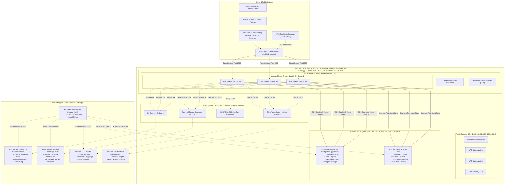
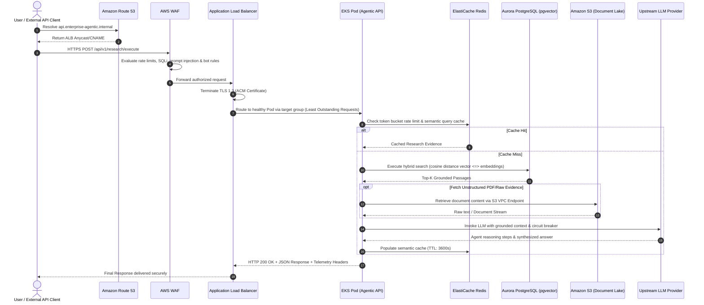

# AWS Target Production Architecture: Enterprise Agentic Platform

This document specifies the target production architecture for deploying the **Enterprise Agentic Research & Knowledge Platform** on Amazon Web Services (AWS). It follows the **AWS Well-Architected Framework** across the Operational Excellence, Security, Reliability, Performance Efficiency, Cost Optimization, and Sustainability pillars.

---

## 1. High-Level Architecture Diagram

---

## 2. End-to-End Request Journey

---

## 3. Comprehensive AWS Component Breakdown

### 3.1 Networking & Isolation (VPC Architecture)
* **Amazon Virtual Private Cloud (VPC)**:
  - CIDR: `10.0.0.0/16` providing 65,536 private IP addresses across 3 Availability Zones (`us-east-1a`, `us-east-1b`, `us-east-1c`).
* **Subnet Tiers**:
  1. **Public Subnets (`10.0.1.0/24`, `10.0.2.0/24`, `10.0.3.0/24`)**:
     - Host the Internet Gateway (IGW), ALBs, and 1 NAT Gateway per AZ for outbound high availability.
  2. **Private Application Subnets (`10.0.10.0/24`, `10.0.20.0/24`, `10.0.30.0/24`)**:
     - Host EKS worker nodes and application containers. No direct internet ingress. Egress to external LLMs routes through NAT Gateways.
  3. **Isolated Database Subnets (`10.0.100.0/24`, `10.0.101.0/24`, `10.0.102.0/24`)**:
     - Host Aurora PostgreSQL and ElastiCache Redis. Zero internet route table entries (no IGW, no NAT Gateway). Completely unreachable from the internet.
* **AWS PrivateLink (VPC Endpoints)**:
  - **S3 Gateway Endpoint**: Free internal routing to S3 buckets without NAT Gateway egress data transfer charges.
  - **Interface Endpoints (Secrets Manager, ECR, CloudWatch Logs, STS)**: Ensures intra-VPC API calls stay entirely on the AWS private fiber backbone.

---

### 3.2 Edge, Ingress & Load Balancing
* **Amazon Route 53**:
  - Global DNS service with latency-based routing, health check failover, and alias records mapped to the ALB.
* **AWS WAF (Web Application Firewall)**:
  - Attached directly to the ALB. Inspects HTTP/S headers, body payload size, rate limits per IP, and protects against OWASP Top 10 vulnerabilities, credential stuffing, and prompt-injection payloads.
* **AWS Certificate Manager (ACM)**:
  - Free, auto-renewing SSL/TLS 1.3 certificates for custom domains with strict cipher suites.
* **AWS Application Load Balancer (ALB)**:
  - Layer 7 ingress load balancer provisioned via the **AWS Load Balancer Controller** in EKS.
  - Features: Automatic cross-zone load balancing, HTTP/2 and gRPC support, connection draining (30s), active health checks targeting `/ready`, and least-outstanding-requests routing algorithm.

---

### 3.3 Compute & Container Orchestration (EKS & ECR)
* **Amazon ECR (Elastic Container Registry)**:
  - Fully managed, KMS-encrypted Docker registry.
  - Features: Automated vulnerability scanning on push (Inspector integration), immutable image tagging (`sha-<short_sha>`, `v<semver>`), and lifecycle policies pruning untagged images older than 14 days.
* **Amazon EKS (Elastic Kubernetes Service)**:
  - **Control Plane**: Fully managed by AWS across 3 AZs with automated etcd backups, 99.95% SLA, and envelope encryption of Kubernetes secrets using KMS.
  - **Data Plane (Managed Node Groups & Karpenter)**:
    - EC2 instance types: `m6i.large` / `c6i.xlarge` (compute-optimized for LLM response processing) and `g5.xlarge` (for optional local tensor/embedding inference).
    - Mix of On-Demand (base baseline) and Spot Instances (scaling tier) with automated graceful spot termination notices (2-minute warning handling).
  - **Networking CNI**: AWS VPC CNI providing direct VPC IP addresses to Pods with Security Groups per Pod support.
  - **Autoscaling**:
    - **Horizontal Pod Autoscaler (HPA)**: Scales pods between 2 and 50 based on CPU (70%), Memory (80%), and custom Prometheus metrics (e.g., active research tasks).
    - **Karpenter**: Just-in-time node provisioning in under 45 seconds directly matching pod resource constraints.

---

### 3.4 Identity, Security & Access Management (IAM & IRSA)
* **IAM Roles for Service Accounts (IRSA)**:
  - Uses the EKS OIDC identity provider to bind AWS IAM roles directly to specific Kubernetes `ServiceAccount` objects.
  - **Zero Static Credentials**: Pods obtain short-lived STS tokens automatically mounted by the kubelet.
  - **Principle of Least Privilege**:
    - `agentic-api-sa`: Allowed only to read specific Secrets Manager keys, read/write specific S3 knowledge buckets, and send metrics to CloudWatch.
    - Cannot access administrative AWS APIs or other workloads' data.
* **Security Groups Hierarchy**:
  - `ALB-SG`: Ingress 443 from `0.0.0.0/0` (or corporate CIDR).
  - `EKS-Nodes-SG`: Ingress 8000 only from `ALB-SG`.
  - `Database-SG`: Ingress 5432 only from `EKS-Nodes-SG`.
  - `Redis-SG`: Ingress 6379 only from `EKS-Nodes-SG`.

---

### 3.5 Data Services & Storage Architecture
* **Amazon Aurora PostgreSQL / RDS PostgreSQL (with `pgvector`)**:
  - **Vector Database**: Stores chunk embeddings (1536-dim or 384-dim), HNSW/IVFFlat vector indexes, metadata documents, and agent execution logs.
  - **High Availability**: Multi-AZ deployment with active-standby automatic failover (< 30 seconds) and read replicas for retrieval scaling.
  - **Performance**: Aurora I/O-Optimized storage with automated continuous backup to S3 and point-in-time recovery (PITR) up to 35 days.
* **Amazon ElastiCache for Redis (or Valkey)**:
  - **In-Memory Acceleration**: Multi-AZ cluster with auto-failover and cluster mode enabled.
  - **Functions**:
    1. Fast distributed rate limiting (Token Bucket / Sliding Window).
    2. Semantic Cache for repeated research questions and tool responses.
    3. Research session scratchpads and ephemeral agent state.
* **Amazon S3 (Simple Storage Service)**:
  - **Document Lake**: Stores raw ingested PDFs, corporate knowledge docs, markdown artifacts, research reports, and evaluation datasets.
  - **Security & Lifecycle**:
    - Default KMS CMK encryption with bucket key enabled.
    - S3 Intelligent-Tiering to automatically move inactive research docs to Infrequent Access / Glacier Instant Retrieval.
    - Object Versioning and S3 Object Lock for regulatory compliance.

---

### 3.6 Secrets Management & Encryption
* **AWS Secrets Manager**:
  - Stores database connection strings, upstream LLM API tokens (OpenAI, Anthropic, Cohere), and JWT signing secrets.
  - **Kubernetes Integration**: Secrets Store CSI Driver with AWS Provider syncs secrets directly into container memory (tmpfs) or environment variables without persisting them to disk.
  - Automatic rotation via AWS Lambda for database passwords.
* **AWS Key Management Service (KMS)**:
  - Dedicated Customer Managed Keys (CMKs) with key rotation enabled annually:
    - `kms-eks-secrets`: Encrypts Kubernetes secrets in etcd.
    - `kms-aurora`: Encrypts Aurora DB storage and snapshots.
    - `kms-redis`: Encrypts ElastiCache data in-transit and at-rest.
    - `kms-s3`: Encrypts knowledge base S3 objects.
    - `kms-ebs`: Encrypts worker node root and persistent volumes.

---

### 3.7 Observability, Telemetry & Compliance
* **Amazon CloudWatch & Container Insights**:
  - Collects pod-level CPU, memory, network, and disk metrics via AWS Distro for OpenTelemetry (ADOT).
  - Centralized log aggregation with 30-day retention and CloudWatch Logs Insights queries.
* **AWS X-Ray / OpenTelemetry**:
  - End-to-end distributed tracing across user request → FastAPI middleware → LangGraph/Agent execution loop → Vector search → Upstream LLM calls.
* **Continuous Security & Compliance**:
  - **AWS GuardDuty**: Intelligent threat detection for VPC flows and EKS audit logs.
  - **AWS Security Hub**: Automated CIS AWS Foundations Benchmark compliance monitoring.

---

## 4. Summary Matrix of AWS Services

| Component | AWS Service | High Availability / Scaling Strategy | Security / Encryption Standard |
| :--- | :--- | :--- | :--- |
| **DNS & Edge** | Route 53 + AWS WAF | Global Anycast, Multi-AZ health failover | TLS 1.3 ACM, OWASP Top 10 rules |
| **Ingress** | Application Load Balancer | Spans 3 Public Subnets, Auto-scaling | TLS termination, Security Group isolation |
| **Container Engine** | Amazon EKS (v1.31+) | Managed Control Plane across 3 AZs + Karpenter | Non-root containers, IRSA, KMS etcd encryption |
| **Container Storage** | Amazon ECR | Multi-Region replication ready | KMS encryption, Inspector scan-on-push |
| **Relational & Vector DB** | Aurora PostgreSQL (`pgvector`) | Multi-AZ Primary + Auto-scaling Read Replicas | KMS CMK at rest, TLS in transit, Private Subnet |
| **In-Memory Cache** | ElastiCache Redis | Multi-AZ with automated failover | In-transit TLS + Redis AUTH, KMS at rest |
| **Object Lake** | Amazon S3 | 99.999999999% (11 9's) durability | KMS CMK, S3 Block Public Access, Versioning |
| **Secrets Engine** | AWS Secrets Manager | Multi-Region replication capable | KMS CMK, Secrets Store CSI driver |
| **Identity & IAM** | AWS IAM (IRSA) | Global IAM with regional STS endpoints | OIDC federated least-privilege policies |
| **Telemetry** | CloudWatch + X-Ray | CloudWatch multi-AZ ingestion | Encrypted log groups, ADOT tracing |
