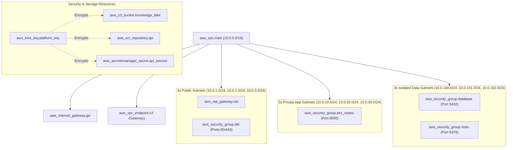

# Terraform Infrastructure as Code Guide

This document outlines the Terraform Infrastructure as Code (IaC) architecture and operational procedures for provisioning the AWS foundation for the Enterprise Agentic Platform.

---

## 1. Directory Structure

```
terraform/
├── versions.tf               # Provider constraints (AWS ~> 5.0), backend & provider defaults
├── variables.tf              # Parameterized inputs (VPC CIDR, subnets, regions, cluster name)
├── terraform.tfvars.example  # Example values file for staging and production
├── vpc.tf                    # Multi-AZ VPC, 3-tier subnets, IGW, NAT Gateways, S3 Gateway Endpoint
├── security_groups.tf        # Security groups for ALB, EKS Nodes, Aurora DB, and Redis
├── kms.tf                    # KMS Customer Managed Key (CMK) with annual rotation
├── s3.tf                     # Encrypted S3 Knowledge Document Lake with versioning & public block
├── ecr.tf                    # Amazon ECR container registry with immutable tagging & scan-on-push
├── secrets.tf                # AWS Secrets Manager resource for application credentials
└── outputs.tf                # Exported VPC, subnet IDs, security groups, and resource ARNs
```

---

## 2. Resource Hierarchy & Network Topology



---

## 3. Operational Workflow

### 1. Initialization
```bash
terraform -chdir=terraform init
```

### 2. Validation & Linting
```bash
terraform -chdir=terraform validate
```

### 3. Speculative Execution Plan
```bash
terraform -chdir=terraform plan -out=tfplan.binary
```

### 4. Controlled Production Application (Requires Explicit Approval)
```bash
# WARNING: Only run in designated deployment windows with approved change requests
terraform -chdir=terraform apply tfplan.binary
```

---

## 4. Key Security & Operational Controls
- **Non-Root & Security Groups**: Micro-segmented traffic between ALB → EKS Nodes → Database & Redis.
- **KMS Envelope Encryption**: All storage resources (S3, ECR, Secrets Manager) are encrypted with a Customer Managed Key.
- **Immutable Container Tagging**: Amazon ECR enforces image immutability to prevent tag hijacking.
- **S3 Public Access Block**: Zero public exposure on knowledge document storage buckets.
